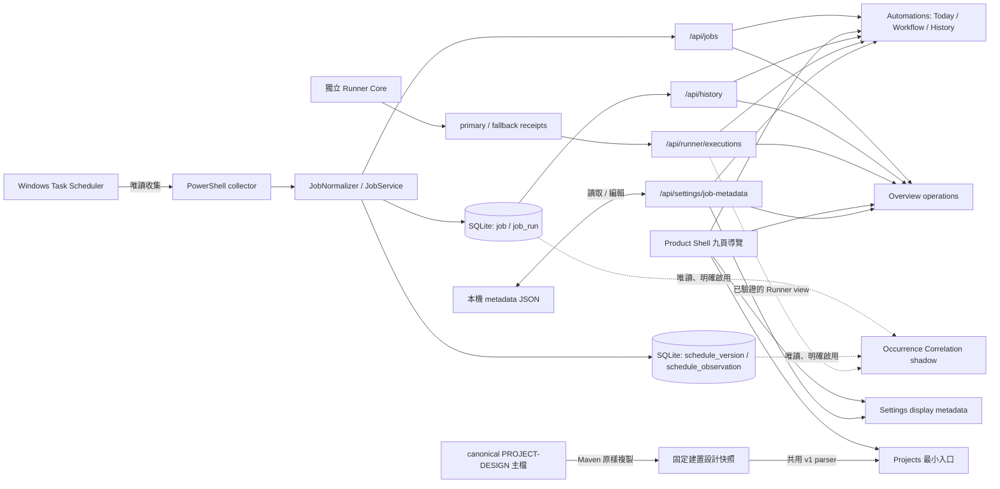
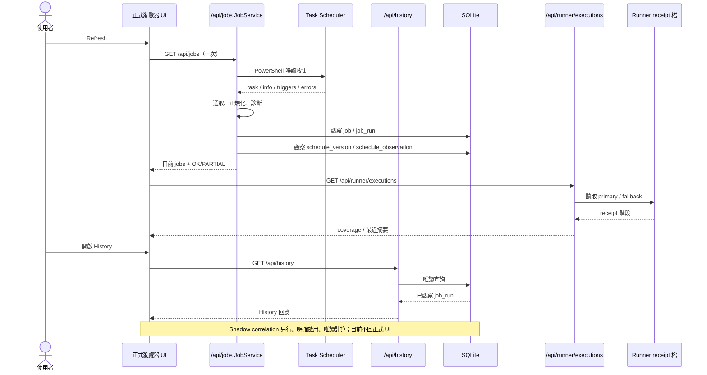

# Local Dashboard 現況系統設計（As-Built）

> 歷史盤點基準：`main` 的 `085757affe2c2dc0c1de45663395e418ad702e3e`；既有系統敘述依該基準與 Stage 文件。2026-09-30 的 Release 1A-1 Projects 最小入口已通過初審與 Manager Review，合併至 main `9e3c8cb`。Port 43871 整合已通過獨立初審與 Manager Review，合併 main `eba1003`；repository／package 核准不代表桌面目前安裝版本，須由獨立 deployment evidence 驗證。這是程式與既有 Stage 文件的對照，不是對某一天 Windows 排程實際執行的驗收紀錄。文中的時間例子是說明，不是投資資料或實際執行證據。

先記住四件事：**Today 是現在讀到的 Scheduler 快照；History 是 Dashboard 曾看見並存下的結果；Runner 是有映射工作才可能有的另一份執行證據；Schedule Snapshot／Correlation 目前沒有正式畫面。** 想查某個欄位時可直接看第 12 節，想找對應程式可看第 14 節。

## 1. 一眼看懂目前系統

**這功能解決什麼問題：** 在同一個本機畫面查看受監控 Windows 排程的現況、最近一次結果、已觀察到的執行歷史，以及有設定的 Runner 執行證據。

**它怎麼運作：** Release 1B 已合併並提供 **九頁主要導覽**。Overview 讀現有 jobs／History／Runner；Automations 提供 Today／7-day History、Workflow 與 Runner coverage；Settings 提供原有顯示 metadata 編輯；Projects 保留最小建置快照 Viewer。已合併 Release 2A 的 US Signals 切片由獨立 `ui/us-signals.mjs` → `/api/us/signals` → 固定 ProcessBuilder → Insider reports contract v1 唯讀 CLI；不直接開外部 SQLite，不執行 pipeline。分數來源是 Imported AI report，交易／報告日期、null／quality flags 與 sanitized provenance 保留。Release 2B 另加獨立 `ui/us-sec-transactions.mjs` → `/api/us/sec-transactions` → 固定 sec operation，共用相同 process bounds；無 SEC scoring、不 join reports，保留 non-P／derivative／owners／footnotes／review／null。P／candidate 尚未認證，4/A 未對帳；來源位置 ID 非 immutable event ID，execution price 非策略進場價。本輪 2B 待管理初審、未合併／部署。Windows Task Scheduler 是排程現況的來源；Dashboard 自己的 SQLite 保存「看見過什麼」；Runner receipts 是另一套執行證據。三者的身分與語意分開保存。排程版本與 occurrence correlation 已在程式中，但 correlation 仍是 shadow research，沒有正式 UI／HTTP API。

**目前限制：** 九頁導覽已實作部分功能；US Stocks 已有 reports Signals／SEC Transactions partial 切片（PARTIAL），Ticker Detail 未接。SEC amendments/corrections 不 collapse；來源完整性與完整 4/A reconciliation 尚未驗證。TW Stocks／Performance／Reports／Data & Evidence 仍是 DESIGNED 入口。Overview 僅涵蓋 operations，不顯示投資 metrics 或完成百分比。`design/prototype/index.html` 仍是獨立靜態設計原型。沒有自動 `MISSED`；Dashboard 不修改 Scheduler task 或正式 Runner config，也不把 correlation 結果寫入資料庫。參照 [`DASHBOARD-DESIGN-SPACE.md`](DASHBOARD-DESIGN-SPACE.md) 時，應將其視為產品設計，勿誤當完整現況畫面。Signals 跨頁非 PIT、無 freshness policy，來源讀失敗保持 unavailable，詳見 [Release 2A](STAGE-RELEASE-2A.md)。

## 2. 啟動、設定與安全停止

**這功能解決什麼問題：** 不需要使用者自行安裝 Java 或開命令列，也能啟動／停止一個可識別的本機 Dashboard，並保留設定與歷史。

**它怎麼運作：** 包裝版的 `LocalDashboard.exe` 使用內含 Java runtime；無參數啟動時取得共用 lock，先檢查是否已有本產品服務，缺少外部 `config/application.yml` 才從包裝範本 create-only 建立；再啟動 Spring server，等待 `127.0.0.1:43871/api/launcher/status` 回傳精確 readiness 字串，最後用預設瀏覽器開啟頁面。既有服務須先核對 server.pid、精確建立時間、此 image 的 bundled executable/JAR、完整 command、指定 home 的 config URI、listener owner 與 readiness，開瀏覽器前再驗一次；身分不一致即拒絕，不再啟第二份。預設外部工作目錄是 `%LOCALAPPDATA%\LocalDashboard`，資料庫在 `data/local-dashboard.db`，可用絕對路徑 `LOCAL_DASHBOARD_HOME` 調整；config、DB、logs 不放在 app-image 內。`--stop`／Stop shortcut 取得同一 lock，依 PID 與建立時間、bundled executable/JAR/命令、43871 listener 所屬 PID、readiness 身分交叉驗證後才終止單一 server。設定清單由外部 YAML 控制；repo 的 `application.yml` 預設 `include: []` 表示不監控任何工作，包裝版首次建立的範本另有既有監控項目。

**Port 決策與部署界線：** Launcher／Safe Stop 的正式 source target 為 43871，整合已核准並合併 main `eba1003`；Release 1A-1 的 8080 是歷史基準。Repository／package 核准不代表桌面目前安裝版本；實際 installed version 須由獨立 deployment evidence 驗證。見 [43871 Stage](STAGE-PORT-43871-CURRENT-MAIN.md)。

**目前限制：** 正式 source 的包裝程式固定 loopback／43871；瀏覽器關閉不等於服務停止。`--stop` 身分不明時拒絕，不能用來停止任意 Java 或 Windows Scheduled Task。Windows bundled JDK 不保證 graceful shutdown；停止可能是強制程序終止。沒有 installer、Service、開機自啟或 updater。細節見 [`WINDOWS-LAUNCHER.md`](WINDOWS-LAUNCHER.md) 與 [`WINDOWS-SAFE-STOP.md`](WINDOWS-SAFE-STOP.md)。

## 3. Scheduler 收集到 `/api/jobs`

**這功能解決什麼問題：** 把 Windows 排程原本分散的狀態，轉成一份可顯示、保留原始身分的目前快照。

**它怎麼運作：** 每按一次 Refresh，瀏覽器只請求一次 `GET /api/jobs`。`JobService` 在有 `dashboard.scheduler.include` 時叫 `PowerShellCollector` 執行內附的 `collect-scheduler.ps1`；腳本唯讀取得 task 與 task info、trigger、設定、Windows 時區及收集錯誤。`TaskSelection` 應用 include/exclude；`JobNormalizer` 驗證資料，把 `TaskPath + TaskName` 小寫後作 Base64URL 無 padding，成為 Dashboard canonical `job.id`。它區分「目前狀態」`status`（如 READY/RUNNING/DISABLED/FAILED/UNKNOWN）和「最後一次已完成結果」`lastRunStatus`（SUCCESS/FAILED/UNKNOWN），並保留 Scheduler 原始資料。Windows 未設定日期轉成 null；資料缺漏會出 warning。`JobService` 把同一次快照交給 History 與 Schedule Snapshot 觀察，再回傳 `OK`／`PARTIAL` 加 diagnostics。`GET /api/jobs/{id}` 會重新收集，不是讀既有快照。

**目前限制：** `LastTaskResult=0` 只表示 Scheduler 回報 exit code 0，不驗證應用程式的業務結果；READY 不表示今天已跑。`NextRunTime` 是當次 Scheduler 提供的下次時間，`scheduledAt`／duration 目前不由 Normalizer 推算。空 include 直接回 `NOT_CONFIGURED`，不觸碰 Scheduler。收集失敗可能回 503；部分 task 失敗則保留可取得資料並標 `PARTIAL`。目前完全不產生 `MISSED`。

## 4. Overview、Automations、Workflow、History 畫面

Release 1B 的 `ui/shell.mjs` 管主要導覽；`ui/overview.mjs` 只從已驗證的 Dashboard snapshot 衍生摘要。Refresh 開始即清空舊 counts／History，丟棄過期 History 回應；recent 依完整 UTC 小數秒排序。monitored count 不受 Today filters／metadata hidden 影響，PARTIAL 僅表示已收集 jobs，NOT_CONFIGURED／error 不顯示假零。Upcoming 排除過去或停用工作的 nextRunAt。Settings 保存仍使用既有 revision／validation API。詳見 [Release 1B](STAGE-RELEASE-1B.md)。

**這功能解決什麼問題：** 讓使用者快速看目前有哪些受監控工作、最後狀態、最近七天 Dashboard 實際觀察到的執行。

**它怎麼運作：** `dashboard.mjs` 把 `/api/jobs` 快照顯示於 Today，按市場、狀態與 metadata 排列；摘要的「需留意」來自當前 status，不是漏跑判斷。Workflow 在 Today 內按台股／美股呈現預設順序與依賴文字，點卡片進同一工作詳情；這是工作關係的**展示**，不會啟動或阻擋下游工作。History tab 以瀏覽器本地七個日曆日算出 UTC 查詢界線，讀 `GET /api/history?from=...&to=...`，將當前工作與只在歷史存在的工作按 canonical ID 合併。日期格可展開該日全部已觀察執行；有日期的舊檢查工作可摺疊。現在的 UI 另讀一次 `/api/runner/executions` 以顯示 coverage 與詳情。

**目前限制：** History 不是 Windows Event Log 全量紀錄；空格只表示資料庫沒有該日可顯示的已觀察執行，絕不代表漏跑。Workflow 依賴圖不是執行引擎；預設只呈現設定順序中前段工作。Release 1B 把 Today／History 搬至 Automations，保留原有功能；Release 2A 已合併 reports Signals；Release 2B 新增 SEC partial，四個資料入口仍未接入。

## 5. SQLite：工作身分與已觀察執行

**這功能解決什麼問題：** 保存跨重啟的工作與最後執行觀察，讓七天 History 不只依賴當下 Scheduler 快照。

**它怎麼運作：** `HistoryObserver` 啟動時初始化 SQLite schema，往後每次 `/api/jobs` 收集都可重試。V1 表 `job` 以 canonical `id` 為鍵，保存原 `task_path`、`task_name`、enabled 與 first/last seen；`job_run` 以 `(job_id, observed_run_at)` 唯一，只有 Scheduler `LastRunTime` 可用且 Normalizer 判為 SUCCESS／FAILED 才寫。再次看見同一筆會更新最後觀察時間及較新的結果，不會複製執行。`GET /api/history` 以唯讀方式查詢，參數必須是 UTC `Z`，範圍最多 31 天。

**目前限制：** Scheduler 只供目前的 `LastRunTime`；如果 Dashboard 在 14:30 與 17:00 之間沒有觀察，就可能只存到較晚的那次，無法事後補出早一次。`job_run.observed_run_at` 不是 trigger ID，也不能證明由哪個 trigger 啟動。失敗儲存會回報 `HISTORY_PERSISTENCE_FAILED`，仍可顯示當次 Scheduler 現況；History 讀取失敗回 503。未知／非本專案版本的非空 DB 不會被默默覆寫。表定義見 `src/main/resources/db/migration/V1__observed_history.sql`。

## 6. Runner Core、receipt 與 coverage

**這功能解決什麼問題：** 對有採用 Runner 的排程，另外保存子程序是否真的啟動、如何結束的證據；在 Dashboard 看出「有映射但沒有 receipt」等覆蓋缺口。

**它怎麼運作：** `RunnerMain` 是獨立的一次性程式，按可信 `RunnerConfig` 的 profile 啟動指定 executable，不呼叫 Spring、HTTP 或 Task Scheduler。它以 `STARTED`、`PROCESS_STARTED`、`TERMINAL` 階段寫入 execution receipt，將每個 execution ID 放獨立目錄，使用暫存檔與原子搬移發布。primary receipt 目錄寫入失敗時切換到獨立 fallback spool；Dashboard 的 `RunnerReceiptService` 讀兩處，按 execution ID 合併並驗證 job/profile/lifecycle，只對外給有限摘要，不暴露命令參數或輸出。`GET /api/runner/executions` 回傳整體狀態與逐映射 coverage，例如 `RUNNER_EVIDENCE_AVAILABLE`、`MAPPED_NO_RECEIPT`、`MAPPED_PROFILE_MISSING`、`RUNNER_UNAVAILABLE`；Today 有 coverage 面板，工作詳情有最近執行與來源。映射用完整 Scheduler task path 對應 Runner profile，而 Runner 原生 job ID 與 Dashboard canonical ID 保持不同命名空間。

**目前限制：** Runner 只涵蓋已改用它、且正式 config 有映射的工作；沒有 receipt 不等於沒執行。兩個 receipt 位置都不可寫時子程序仍可執行，但執行證據可能遺失。receipt 沒有 Scheduler nominal trigger／scheduledFor；`PROCESS_STARTED` 前失敗或缺 terminal 是不完整證據。Runner 不提供 child timeout；不得用 Scheduler exit 0 代替 Runner 或應用層成功。詳見 [`STAGE-RUNNER-RECEIPTS-UI.md`](STAGE-RUNNER-RECEIPTS-UI.md) 與 [`STAGE-RUNNER-COVERAGE-DIAGNOSTICS.md`](STAGE-RUNNER-COVERAGE-DIAGNOSTICS.md)。

## 7. Schedule Snapshot History：看過哪些排程版本

**這功能解決什麼問題：** 保存 Dashboard 何時看見哪一版 trigger／設定，避免日後用「現在排程」倒推舊日規則。

**它怎麼運作：** 同一次 `/api/jobs` 正規化快照交給 `ScheduleSnapshotObserver`。`ScheduleDefinition` 只取允許的 enabled、相關 settings、trigger、timezone 等欄位形成 canonical JSON 與 SHA-256 fingerprint；相同版本延長 `last_observed_at`，不同或中間曾 absent 則新增一個 `schedule_version` episode，保留與前次看見時間的 gap。每次見到 task 寫一筆 `schedule_observation=PRESENT`，附 `OK` 或 `PARTIAL`。只有整次收集完整時，對以前看過、目前仍在 include 且沒有被 exclude、這次未出現的工作寫 `ABSENT_OBSERVED`；已 absent 不重複寫，同時間或較舊觀察不覆蓋新資料。V2 表與 History 位於同一 SQLite DB。

**目前限制：** `ABSENT_OBSERVED` 只表示完整監控快照中未見該工作，不證明 task 被刪除或某次執行漏掉。收集錯誤、unmatched include、History persistence 診斷使快照不完整時不寫 absence；監控範圍外也不寫。觀察時間不是 Windows 實際修改時間，兩次觀察間的生效版本仍可能不明。保存失敗回 `SCHEDULE_SNAPSHOT_PERSISTENCE_FAILED`，不修改 Scheduler。此資料目前沒有正式 UI／API。詳見 [`STAGE-SCHEDULE-SNAPSHOT-HISTORY.md`](STAGE-SCHEDULE-SNAPSHOT-HISTORY.md)。

## 8. Occurrence Correlation：唯讀 shadow 推論

**這功能解決什麼問題：** 研究「某次已觀察執行可能對應哪個預定觸發時段」，同時保留時間重疊或資料不完整的不確定性。

**它怎麼運作：** 需明確啟用的 `OccurrenceEvidenceRepository` 以 SQLite `mode=ro` 讀 `schedule_version` 與 `job_run`，不刷新 `/api/jobs`。`OccurrenceCorrelation.generate` 在最多 32 天內，從已保存版本的 enabled daily／weekly、具明確時區 offset 的 trigger 產生各自的 nominal occurrence；ID 是 job ID、版本 episode ID、trigger 身分與 UTC `scheduledFor` 的確定性雜湊。它可把 Scheduler 歷史與可信映射的 Runner child receipt 當執行證據；僅在同一 full task/canonical ID、正確 Runner job/profile、結果一致、開始時間相差 30 秒內且互相唯一時合併。其餘保持兩筆證據。執行結果 SUCCESS／FAILED 與「是否對上時段」是兩個維度：失敗的真實執行仍可 `CORRELATED + EXECUTED_FAILED`。

| Shadow 判定 | 實際意思 |
| --- | --- |
| `CORRELATED` | 在已觀察版本的正常視窗內，只有一個可支持的 occurrence 候選；仍不是 Windows trigger provenance 證明。 |
| `AMBIGUOUS` | 多個候選、提前開始但無來源證明，或版本觀察空檔；版本空檔以 `AMBIGUOUS_SCHEDULE_VERSION` 優先。 |
| `UNMATCHED` | 明確知道是手動啟動，或在有版本覆蓋的時間裡落在所有合理視窗之外。 |
| `UNSUPPORTED` | 該時段相關的 trigger／時區語意尚不支援；久遠舊版不污染目前已支持版本。 |
| `INSUFFICIENT_EVIDENCE` | 沒有版本歷史、執行證據不完整、超出已觀察區間，或單一晚到 catch-up 仍無法證實。 |

**目前限制：** 正常視窗 `-2/+5 分鐘`、可能 catch-up 最多 `3 小時`、兩來源合併 `30 秒` 都是研究 policy，**不是** Windows Scheduler provenance guarantee。提前候選保持 `AMBIGUOUS`；單一晚到候選保持 `INSUFFICIENT_EVIDENCE`；多 trigger 重疊保持 `AMBIGUOUS`。不支援 offset-less/DST 未定義、一次性／月度／重複或 delay trigger 的自動配對。沒有正式 UI、HTTP endpoint、持久化 correlation、通知或 production `MISSED`；`MISSED` 仍受後續 evidence gate 限制。詳見 [`STAGE-OCCURRENCE-CORRELATION.md`](STAGE-OCCURRENCE-CORRELATION.md)。

## 9. 可編輯的顯示設定

**這功能解決什麼問題：** 讓工作顯示名稱、中文用途、市場、順序、隱藏與依賴關係可按個人理解調整。

**它怎麼運作：** `dashboard.mjs` 有預設 metadata（含名稱模式）；`JobMetadataStore` 預設將使用者覆寫存於 `%LOCALAPPDATA%\LocalDashboard\config\job-metadata.json`，`GET/PUT /api/settings/job-metadata` 以 revision 做衝突檢查、驗證依賴及循環，並原子替換檔案。畫面把預設與使用者覆寫合併，按原始 TaskName 對應顯示設定；可重設個別或全部。這些欄位只改 Today／Workflow／History 與 Overview labels 的呈現；Overview monitored count 仍涵蓋完整收集快照。

**目前限制：** 編輯顯示名稱或依賴不會改 Scheduler task、trigger、Runner config、SQLite canonical job ID，也不會執行依賴控制。設定毀損會以警告與預設值退回；revision 衝突須重新讀取後再存。metadata 預設路徑由 `LOCALAPPDATA` 決定，**不隨** `LOCAL_DASHBOARD_HOME` 移動；測試／部署可用 `dashboard.metadata.path` JVM property 明確覆寫。`config/application.yml` 的監控 include/exclude 仍是外部部署設定，不是這個 metadata 表單。

## 10. 雙 trigger 例子：AIStockHunter-UnexplainedVolume-Daily

**這功能解決什麼問題：** 理解一個 Scheduler task 有 14:30 與 17:00 兩個 trigger 時，為何不能把最後一次執行硬配到其中一個。

**它怎麼運作：** 以下是 Stage B 的說明情境，假設工作完整路徑是 `\AIStockHunter-UnexplainedVolume-Daily`、兩個 weekday trigger 皆被完整收集，時間具明確 `+08:00` offset，且對應的 Runner mapping／receipt 在需要時存在。

1. `collect-scheduler.ps1` 回傳**一個 task**、內含**兩個 trigger**；`JobNormalizer` 給 task 一個 canonical Dashboard job ID。`/api/jobs` 的 `NextRunTime` 只顯示 Scheduler 當下回報的下一次，不是一張兩次 trigger 的完整執行清單。
2. 一次完整觀察把這兩個 trigger 存進同一個 `schedule_version.definition_json`，寫一筆 `PRESENT`。它證明「這次看到了這個設定」，尚不證明兩次都執行。
3. 如果 14:32 執行後 Dashboard 有刷新，Scheduler `LastRunTime=14:32` 且結果可判定，`job_run` 可保存該次。若直到 17:02 之後才首次刷新，Scheduler 可能只提供 17:02，History 不會自動補出 14:32。
4. 若該工作由 Runner 啟動且 mapping 正確，兩次執行可能各有 receipt；UI 只讀可用的 receipts、顯示 coverage 和最近明細。Runner 原生 job ID 不直接拿來與 Dashboard ID 比較；缺 receipt 不證明未執行。
5. Shadow generation 為 14:30／17:00 建立**兩個不同 occurrence ID**。在有足夠版本與執行證據時，14:32 可對 14:30 `CORRELATED`；16:58 同時可能是 14:30 晚到 catch-up 與 17:00 提早候選，故為 `AMBIGUOUS`；17:02 若無競爭證據可對 17:00 `CORRELATED`。這些是 model 判定，不會出現在正式 UI，也不會產生 `MISSED`。

**目前限制：** 上述 14:32／16:58／17:02 不是本機實際執行紀錄。實際 Windows 工作的 trigger 內容、版本、Runner 覆蓋及 child outcome 均需當次資料才能確定；即使 model 說 `CORRELATED`，也不能宣稱已取得 Windows 的 trigger-origin 證據。

## 11. End-to-end：一次 Refresh 到畫面與研究模型

**這功能解決什麼問題：** 分辨同一個畫面更新，哪些資料是現讀、哪些會留下歷史、哪些只在研究時推算。

**它怎麼運作：**

**目前限制：** 這是邏輯資料流，不代表每個 task 都有 Runner receipt 或每次刷新都能成功寫 DB。`/api/jobs` 寫入觀察資料；`/api/history` 與 Runner diagnostics 不修改 Scheduler。Correlation 不能從畫面的一次 Refresh 直接推斷漏跑。

## 12. 看見 UI 欄位時，資料實際從哪裡來

**這功能解決什麼問題：** 避免把「目前快照」、「曾經觀察」和「Runner 證據」誤當同一種結論。

**它怎麼運作：** 下表對照正式 `index.html`／`dashboard.mjs`；`—` 表示該資料尚未出現在正式 UI。

| UI 顯示／概念 | 實際來源 | 如何解讀／限制 |
| --- | --- | --- |
| 工作名稱、中文說明、市場、順序、隱藏 | Scheduler `TaskName` + `dashboard.mjs` 預設／`job-metadata.json` 覆寫 | 顯示層；原始 TaskPath/TaskName 與 canonical ID 不變。 |
| Current 狀態、Attention 數 | `/api/jobs` → Scheduler `State`、Enabled、LastTaskResult 經 `JobNormalizer` | 當次讀到的狀態；Attention 不是 MISSED。 |
| Last run 時間與結果 | `/api/jobs` → Scheduler `LastRunTime`／`LastTaskResult` | 最近一次；exit 0 不保證應用業務成功。 |
| Next run | `/api/jobs` → Scheduler `NextRunTime` | Scheduler 當下的下次時間；不是完整觸發日曆。 |
| 收集時間、OK/PARTIAL 與錯誤 | `/api/jobs` → collector `collectedAt`、errors、unmatchedIncludes、保存 diagnostics | PARTIAL 摘要只涵蓋取得的工作；保存錯誤不抹掉當次現況。 |
| Workflow 卡片與依賴文字 | 同次 `/api/jobs` + metadata | 只做展示，不控制 task 的執行順序。 |
| History 日期格、次數、結果 | `/api/history` → SQLite `job`／`job_run` | 已觀察結果；空格不是漏跑，可能沒刷新。 |
| Runner ✓／mapped／unavailable、最近 child 結果 | `/api/runner/executions` →可信映射 + primary/fallback receipts | 獨立於 Scheduler；沒 receipt 不是沒執行。 |
| Schedule version／absence | SQLite `schedule_version`／`schedule_observation` | **正式 UI 目前沒有欄位**；absence 只在完整觀察時寫。 |
| Correlation／MISSED | `OccurrenceCorrelation` shadow；無正式 endpoint | **正式 UI 目前沒有 correlation 判定；production MISSED 未啟用**。 |

**目前限制：** UI 與後端資料可能來自不同讀取時刻：Runner receipts 在 `/api/jobs` 成功後另取，History 開頁時另查。它們的顯示不能自動當作同一次原子快照。

## 13. 完成度、限制與定位

**這功能解決什麼問題：** 清楚區分已可日常使用、已保存但尚未呈現、以及只供研究的能力。

**它怎麼運作：**

| 功能 | 目前完成度 | 仍需注意 |
| --- | --- | --- |
| 包裝版啟動／安全停止／外部設定 bootstrap | 已完成 | Windows 身分驗證失敗時安全拒絕；非 Windows 通用服務。 |
| Scheduler 唯讀現況、Today、Workflow | 已完成 | 不是完整 event log；Workflow 不執行工作。 |
| SQLite observed History、7-day UI | 已完成 | 只記錄 Dashboard 看見的 Scheduler LastRunTime。 |
| Runner Core、primary/fallback receipt、UI coverage | 已完成，依工作映射覆蓋 | 未採用 Runner 的工作沒有這層證據。 |
| 使用者 metadata 設定 | 已完成 | 只改顯示，不改 Scheduler/Runner。 |
| Schedule Snapshot History | 已完成保存 | 無正式 UI／API；觀察時間不等於實際變更時間。 |
| Occurrence Correlation | shadow research model 已完成 | 無正式 UI／API、未驗證為 Windows provenance、無 MISSED。 |
| Projects 本專案建置快照入口 | Release 1A-1 最小切片已核准並合併 | 安裝版本須另有 deployment evidence；完整面板與跨專案 aggregation 未完成；九頁 shell 已由 Release 1B 開發實作。 |
| Product Shell／Overview operations | Release 1B PARTIAL 已合併 | 九頁導覽／既有 API，installed app 未更新。 |
| US Stocks Signals／SEC Transactions | PARTIAL | reports Signals 已合併；SEC partial 待本輪初審，Ticker Detail／4A 對帳尚未實作。 |
| 其他四頁資料功能 | DESIGNED | 尚未接入 adapter，只有導覽 destination。 |

**目前限制：** 上表的「已完成」指 repo 中有正式程式與既有 Stage gate；不代表目前這台機器所有 Scheduler task、Runner mapping、資料庫或外部來源均已在本文件撰寫時實機驗收。外部來源只實作 reports Signals 與 SEC Transactions partial；Release 1B／2A 已合併、本輪 2B 待審，均與已安裝版本分開標明。`MISSED` 不可由現有 shadow 時間 heuristics 直接啟用。

## Release 1A-1：Projects 最小正式入口（已核准並合併）

Projects 頁從固定同站 `/project-design/PROJECT-DESIGN.md` 讀取 Maven 本次建置原樣複製的唯一 canonical 主檔。`ui/project-design.mjs` 是正式頁與 prototype generator 共用的 v1 parser；`ui/projects.mjs` 只呈現 Local Dashboard 的 feature ID、名稱、狀態、實作、限制、目的和剩餘工作，counts 從同一份 rows 計算。來源 path、design version、原始 bytes SHA-256、讀取時間與歷史 baseline 都保留，baseline 不是本次實作 SHA。

Loader 僅用固定 same-origin URL、拒絕 redirect、10 秒 timeout、256 KiB streaming 上限；資料缺檔、格式錯誤、不支援版本或服務不可用會清除舊 rows/counts 並顯示安全錯誤，重試可恢復。Markdown 欄位作安全文字顯示，不執行 HTML 或連結來源命令。此路徑不讀外部 repo／DB、不調用 Scheduler／Runner，既有監控接線保留。這是建置快照，不是即時 Git reader 或完整六面板／跨專案 aggregation；驗證與限制見 [Stage evidence](STAGE-PROJECTS-VIEWER-R1A1.md)。

## 14. 功能到 class／API／table 的索引

**這功能解決什麼問題：** 要查細節或請工程師修改時，可以從功能直接找到正式來源。

**它怎麼運作：** 路徑均相對 repository 根目錄；Java class 預設位於 `src/main/java/io/github/neil1031/dashboard/`，Runner／launcher 類分別在其 `runner/`、`launcher/` 子目錄。

| 功能 | 重要檔案／class | API／保存位置 |
| --- | --- | --- |
| 啟動與停止 | `launcher/WindowsLauncher.java`、`WindowsStopLauncher.java`、`SafeStop.java`、`ConfigBootstrap.java`、`LauncherStatusController.java` | `/api/launcher/status`；外部 `config/application.yml`、`server.pid`、logs |
| Scheduler 目前快照 | `PowerShellCollector.java`、`src/main/resources/collect-scheduler.ps1`、`TaskSelection.java`、`JobNormalizer.java`、`JobService.java`、`JobsController.java` | `GET /api/jobs`、`GET /api/jobs/{id}` |
| Projects 最小 Viewer | `ui/projects.mjs`、`ui/project-design.mjs`、`pom.xml` | 固定建置資源 `/project-design/PROJECT-DESIGN.md`；無 DB／新 API |
| Today／Workflow／History UI | `index.html`、`dashboard.mjs` | `/api/jobs`、`/api/history`、`/api/runner/executions` |
| History | `HistoryObserver.java`、`HistoryRepository.java`、`HistoryController.java`、`HistoryRange.java`、`src/main/resources/db/migration/V1__observed_history.sql` | `GET /api/history`；`job`、`job_run` |
| Runner | `runner/RunnerMain.java`、`RunnerConfig.java`、`ReceiptFiles.java`、`RunnerReceiptService.java`、`RunnerReceiptController.java` | `GET /api/runner/executions`；primary/fallback receipt 目錄 |
| Schedule Snapshot | `ScheduleDefinition.java`、`ScheduleSnapshotObserver.java`、`ScheduleSnapshotRepository.java`、`src/main/resources/db/migration/V2__schedule_snapshots.sql` | `schedule_version`、`schedule_observation`；無正式 API |
| Occurrence shadow | `OccurrenceEvidenceRepository.java`、`OccurrenceCorrelation.java` | SQLite `mode=ro` + 已驗證 Runner view；無正式 API／table |
| 顯示設定 | `JobMetadataStore.java`、`JobMetadataController.java`、`dashboard.mjs` | `GET/PUT /api/settings/job-metadata`；外部 `config/job-metadata.json` |

**目前限制：** 本索引是理解與追查入口；具體欄位／錯誤碼仍以對應 class、migration 與 Stage 文件為準。`docs/DASHBOARD-DESIGN-SPACE.md` 和 `design/prototype/` 是未來產品設計材料，與上述正式檔案有意分開。
