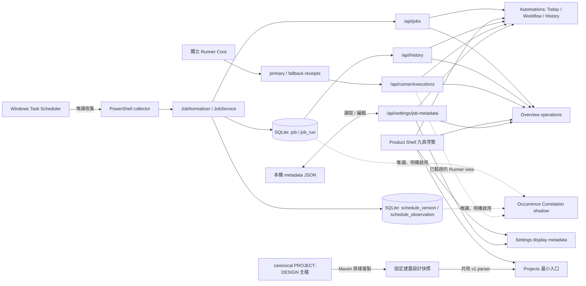
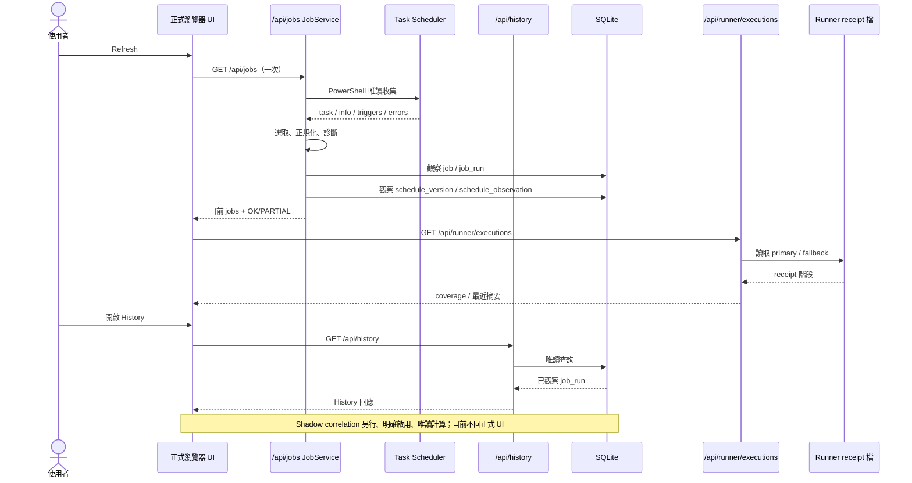
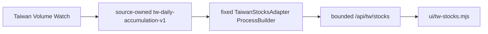
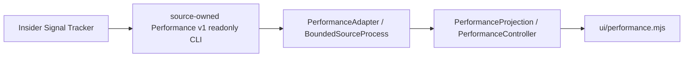
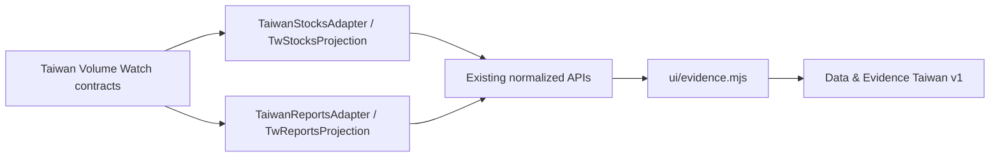

# Local Dashboard 現況系統設計（As-Built）

> 歷史盤點基準：`main` 的 `085757affe2c2dc0c1de45663395e418ad702e3e`；既有系統敘述依該基準與 Stage 文件。2026-09-30 的 Release 1A-1 Projects 最小入口已通過初審與 Manager Review，合併至 main `9e3c8cb`。Port 43871 整合已通過獨立初審與 Manager Review，合併 main `eba1003`；repository／package 核准不代表桌面目前安裝版本，須由獨立 deployment evidence 驗證。這是程式與既有 Stage 文件的對照，不是對某一天 Windows 排程實際執行的驗收紀錄。文中的時間例子是說明，不是投資資料或實際執行證據。

先記住四件事：**Today 是現在讀到的 Scheduler 快照；History 是 Dashboard 曾看見並存下的結果；Runner 是有映射工作才可能有的另一份執行證據；Schedule Snapshot／Correlation 目前沒有正式畫面。** 想查某個欄位時可直接看第 12 節，想找對應程式可看第 14 節。

## 1. 一眼看懂目前系統

**這功能解決什麼問題：** 在同一個本機畫面查看受監控 Windows 排程的現況、最近一次結果、已觀察到的執行歷史，以及有設定的 Runner 執行證據。

**它怎麼運作：** Release 1B 已合併並提供 **九頁主要導覽**。Overview 讀現有 jobs／History／Runner；Automations 提供 Today／7-day History、Workflow 與 Runner coverage；Settings 提供原有顯示 metadata 編輯；Projects 保留最小建置快照 Viewer。已合併 Release 2A 的 US Signals 切片由獨立 `ui/us-signals.mjs` → `/api/us/signals` → 固定 ProcessBuilder → Insider reports contract v1 唯讀 CLI；不直接開外部 SQLite，不執行 pipeline。分數來源是 Imported AI report，交易／報告日期、null／quality flags 與 sanitized provenance 保留。Release 2B 另加獨立 `ui/us-sec-transactions.mjs` → `/api/us/sec-transactions` → 固定 sec operation，共用相同 process bounds；無 SEC scoring、不 join reports，保留 non-P／derivative／owners／footnotes／review／null。P／candidate 尚未認證，4/A 未對帳；來源位置 ID 非 immutable event ID，execution price 非策略進場價。Release 2B 已通過 Manager Review，合併 main `4acd568`；實際安裝狀態由獨立 deployment evidence 確認。Release 2C 專用 `ui/us-ticker-detail.mjs` → `/api/us/ticker-detail` → `UsTickerDetailService` 順序重用既有兩個 adapter operations，保留 process bounds，各來源 failure 不抹除另一成功 section；前端 deadline 75 秒涵蓋兩次 max-30s 與 bounded drains。2C 已隨 main bce84c4 核准累積 image 部署。Release 2D `ui/reports.mjs` → `/api/reports/us-insider` 與 `/detail` → 同一 adapter 的固定 list-reports／get-report，沿用兩個共用 process slots／輸出與逾時界線。All 已實作 US Insider／TW Daily／TW Weekly 三個獨立區域，TW consumer 已整合／部署於 main 7a2f9c45；`safe-markdown.mjs` 以 DOM 文字呈現完整 untrusted 正文，無 innerHTML／可執行連結。Counts 為目前保留／active 列；revision 是正文/hash history、current 可在頁外或 MISSING，無 PIT／semantic diff。2D 已合併 main 40f5aec 並完成核准累積部署。Windows Task Scheduler 是排程現況的來源；Dashboard 自己的 SQLite 保存「看見過什麼」；Runner receipts 是另一套執行證據。三者的身分與語意分開保存。排程版本與 occurrence correlation 已在程式中，但 correlation 仍是 shadow research，沒有正式 UI／HTTP API。

**目前限制：** 九頁導覽已實作部分功能；US Stocks 已有 reports Signals／SEC Transactions partial 切片（PARTIAL），Release 2C Ticker Detail source-separated aggregate 已合併 main `44823ab`、已完成核准累積部署；Reports／SEC 分頁／日期／ID 獨立，無 cross-source join；Ticker Detail 尚未整合 Performance。SEC amendments/corrections 不 collapse；來源完整性與完整 4/A reconciliation 尚未驗證。Reports · All／US Insider 在 Release 2D 為 PARTIAL；TW Daily／Weekly 已核准實作，三來源獨立、無 PIT／semantic diff。TW Stocks v1 已通過 Manager 實作核准，`product-tw` 為 PARTIAL、已整合 main bce84c4 並完成核准累積部署；獨立 Performance v1 已核准為 PARTIAL、已整合 main d69ff5ab 並完成核准正式部署；Data & Evidence Taiwan v1 已核准為 PARTIAL，main c269fe72整合／前次部署已完成。Overview 僅涵蓋 operations，不顯示投資 metrics 或完成百分比。`design/prototype/index.html` 仍是獨立靜態設計原型。沒有自動 `MISSED`；Dashboard 不修改 Scheduler task 或正式 Runner config，也不把 correlation 結果寫入資料庫。參照 [`DASHBOARD-DESIGN-SPACE.md`](DASHBOARD-DESIGN-SPACE.md) 時，應將其視為產品設計，勿誤當完整現況畫面。Signals 跨頁非 PIT、無 freshness policy，來源讀失敗保持 unavailable，詳見 [Release 2A](STAGE-RELEASE-2A.md)。

## 2. 啟動、設定與安全停止

**這功能解決什麼問題：** 不需要使用者自行安裝 Java 或開命令列，也能啟動／停止一個可識別的本機 Dashboard，並保留設定與歷史。

**它怎麼運作：** 包裝版的 `LocalDashboard.exe` 使用內含 Java runtime；無參數啟動時取得共用 lock，先檢查是否已有本產品服務，缺少外部 `config/application.yml` 才從包裝範本 create-only 建立；再啟動 Spring server，等待 `127.0.0.1:43871/api/launcher/status` 回傳精確 readiness 字串，最後用預設瀏覽器開啟頁面。既有服務須先核對 server.pid、精確建立時間、此 image 的 bundled executable/JAR、完整 command、指定 home 的 config URI、listener owner 與 readiness，開瀏覽器前再驗一次；身分不一致即拒絕，不再啟第二份。預設外部工作目錄是 `%LOCALAPPDATA%\LocalDashboard`，資料庫在 `data/local-dashboard.db`，可用絕對路徑 `LOCAL_DASHBOARD_HOME` 調整；config、DB、logs 不放在 app-image 內。`--stop`／Stop shortcut 取得同一 lock，依 PID 與建立時間、bundled executable/JAR/命令、43871 listener 所屬 PID、readiness 身分交叉驗證後才終止單一 server。設定清單由外部 YAML 控制；repo 的 `application.yml` 預設 `include: []` 表示不監控任何工作，包裝版首次建立的範本另有既有監控項目。

**Port 決策與部署界線：** Launcher／Safe Stop 的正式 source target 為 43871，整合已核准並合併 main `eba1003`；Release 1A-1 的 8080 是歷史基準。Repository／package 核准不代表桌面目前安裝版本；實際 installed version 須由獨立 deployment evidence 驗證。見 [43871 Stage](STAGE-PORT-43871-CURRENT-MAIN.md)。

**目前限制：** 正式 source 的包裝程式固定 loopback／43871；瀏覽器關閉不等於服務停止。`--stop` 身分不明時拒絕，不能用來停止任意 Java 或 Windows Scheduled Task。Windows bundled JDK 不保證 graceful shutdown；停止可能是強制程序終止。沒有 installer、Service、開機自啟或 updater。細節見 [`WINDOWS-LAUNCHER.md`](WINDOWS-LAUNCHER.md) 與 [`WINDOWS-SAFE-STOP.md`](WINDOWS-SAFE-STOP.md)。

## 3. Scheduler 收集到 `/api/jobs`

**這功能解決什麼問題：** 把 Windows 排程原本分散的狀態，轉成一份可顯示、保留原始身分的目前快照。

**它怎麼運作：** 每按一次 Refresh，瀏覽器只請求一次 `GET /api/jobs`。`JobService` 在有 `dashboard.scheduler.include` 時叫 `PowerShellCollector` 執行內附的 `collect-scheduler.ps1`；腳本唯讀取得 task 與 task info、trigger、設定、Windows 時區及收集錯誤。`TaskSelection` 應用 include/exclude；`JobNormalizer` 驗證資料，把 `TaskPath + TaskName` 小寫後作 Base64URL 無 padding，成為 Dashboard canonical `job.id`。它區分「目前狀態」`status`（如 READY/RUNNING/DISABLED/FAILED/UNKNOWN）和「最後一次已完成結果」`lastRunStatus`（SUCCESS/FAILED/UNKNOWN），並保留 Scheduler 原始資料。Windows 未設定日期轉成 null；資料缺漏會出 warning。`JobService` 把同一次快照交給 History 與 Schedule Snapshot 觀察，再回傳 `OK`／`PARTIAL` 加 diagnostics。`GET /api/jobs/{id}` 會重新收集，不是讀既有快照。

**目前限制：** `LastTaskResult=0` 只表示 Scheduler 回報 exit code 0，不驗證應用程式的業務結果；READY 不表示今天已跑。`NextRunTime` 是當次 Scheduler 提供的下次時間，`scheduledAt`／duration 目前不由 Normalizer 推算。空 include 直接回 `NOT_CONFIGURED`，不觸碰 Scheduler。收集失敗可能回 503；部分 task 失敗則保留可取得資料並標 `PARTIAL`。目前完全不產生 `MISSED`。

## 4. Overview、Automations、Workflow、History 畫面

Release 1B 的 `ui/shell.mjs` 管主要導覽；`ui/overview.mjs` 只從已驗證的 Dashboard snapshot 衍生摘要。Refresh 開始即清空舊 counts／History，丟棄過期 History 回應；recent 依完整 UTC 小數秒排序。monitored count 不受 Today filters／metadata hidden 影響，PARTIAL 僅表示已收集 jobs，NOT_CONFIGURED／error 不顯示假零。Upcoming 排除過去或停用工作的 nextRunAt。Settings 保存仍使用既有 revision／validation API。詳見 [Release 1B](STAGE-RELEASE-1B.md)。

**這功能解決什麼問題：** 讓使用者快速看目前有哪些受監控工作、最後狀態、最近七天 Dashboard 實際觀察到的執行。

**它怎麼運作：** `dashboard.mjs` 把 `/api/jobs` 快照顯示於 Today，按市場、狀態與 metadata 排列；摘要的「需留意」來自當前 status，不是漏跑判斷。Workflow 在 Today 內按台股／美股呈現預設順序與依賴文字，點卡片進同一工作詳情；這是工作關係的**展示**，不會啟動或阻擋下游工作。History tab 以瀏覽器本地七個日曆日算出 UTC 查詢界線，讀 `GET /api/history?from=...&to=...`，將當前工作與只在歷史存在的工作按 canonical ID 合併。日期格可展開該日全部已觀察執行；有日期的舊檢查工作可摺疊。現在的 UI 另讀一次 `/api/runner/executions` 以顯示 coverage 與詳情。

**目前限制：** History 不是 Windows Event Log 全量紀錄；空格只表示資料庫沒有該日可顯示的已觀察執行，絕不代表漏跑。Workflow 依賴圖不是執行引擎；預設只呈現設定順序中前段工作。Release 1B 把 Today／History 搬至 Automations，保留原有功能；Release 2A 已合併 reports Signals；Release 2B 新增 SEC partial；2C Ticker Detail 已合併但已完成核准累積部署，2D Reports · US Insider 已核准合併並完成累積部署，TW Stocks v1 consumer 已核准實作、已整合 main bce84c4 並完成核准累積部署；獨立 Performance v1 已核准為 PARTIAL、已整合 main d69ff5ab 並完成核准正式部署；Data & Evidence Taiwan 第一切片已核准，broader aggregation 未完成。

## 5. SQLite：工作身分與已觀察執行

**這功能解決什麼問題：** 保存跨重啟的工作與最後執行觀察，讓七天 History 不只依賴當下 Scheduler 快照。

**它怎麼運作：** `HistoryObserver` 啟動時初始化 SQLite schema，往後每次 `/api/jobs` 收集都可重試。V1 表 `job` 以 canonical `id` 為鍵，保存原 `task_path`、`task_name`、enabled 與 first/last seen；`job_run` 以 `(job_id, observed_run_at)` 唯一，只有 Scheduler `LastRunTime` 可用且 Normalizer 判為 SUCCESS／FAILED 才寫。再次看見同一筆會更新最後觀察時間及較新的結果，不會複製執行。`GET /api/history` 以唯讀方式查詢，參數必須是 UTC `Z`，範圍最多 31 天。

**目前限制：** Scheduler 只供目前的 `LastRunTime`；如果 Dashboard 在 14:30 與 17:00 之間沒有觀察，就可能只存到較晚的那次，無法事後補出早一次。`job_run.observed_run_at` 不是 trigger ID，也不能證明由哪個 trigger 啟動。失敗儲存會回報 `HISTORY_PERSISTENCE_FAILED`，仍可顯示當次 Scheduler 現況；History 讀取失敗回 503。未知／非本專案版本的非空 DB 不會被默默覆寫。表定義見 `src/main/resources/db/migration/V1__observed_history.sql`。

## 6. Runner Core、receipt 與 coverage

**這功能解決什麼問題：** 對有採用 Runner 的排程，另外保存子程序是否真的啟動、如何結束的證據；在 Dashboard 看出「有映射但沒有 receipt」等覆蓋缺口。

**它怎麼運作：** `RunnerMain` 是獨立的一次性程式，按可信 `RunnerConfig` 的 profile 啟動指定 executable，不呼叫 Spring、HTTP 或 Task Scheduler。它以 `STARTED`、`PROCESS_STARTED`、`TERMINAL` 階段寫入 execution receipt，將每個 execution ID 放獨立目錄，使用暫存檔與原子搬移發布。primary receipt 目錄寫入失敗時切換到獨立 fallback spool；Dashboard 的 `RunnerReceiptService` 讀兩處，按 execution ID 合併並驗證 job/profile/lifecycle，只對外給有限摘要，不暴露命令參數或輸出。`GET /api/runner/executions` 回傳整體狀態與逐映射 coverage，例如 `RUNNER_EVIDENCE_AVAILABLE`、`MAPPED_NO_RECEIPT`、`MAPPED_PROFILE_MISSING`、`RUNNER_UNAVAILABLE`；Today 有 coverage 面板，工作詳情有最近執行與來源。映射用完整 Scheduler task path 對應 Runner profile，而 Runner 原生 job ID 與 Dashboard canonical ID 保持不同命名空間。

**目前限制：** Runner 只涵蓋已改用它、且正式 config 有映射的工作；沒有 receipt 不等於沒執行。兩個 receipt 位置都不可寫時子程序仍可執行，但執行證據可能遺失。receipt 沒有 Scheduler nominal trigger／scheduledFor；`PROCESS_STARTED` 前失敗或缺 terminal 是不完整證據。Runner 不提供 child timeout；不得用 Scheduler exit 0 代替 Runner 或應用層成功。詳見 [`STAGE-RUNNER-RECEIPTS-UI.md`](STAGE-RUNNER-RECEIPTS-UI.md) 與 [`STAGE-RUNNER-COVERAGE-DIAGNOSTICS.md`](STAGE-RUNNER-COVERAGE-DIAGNOSTICS.md)。

## 7. Schedule Snapshot History：看過哪些排程版本

**這功能解決什麼問題：** 保存 Dashboard 何時看見哪一版 trigger／設定，避免日後用「現在排程」倒推舊日規則。

**它怎麼運作：** 同一次 `/api/jobs` 正規化快照交給 `ScheduleSnapshotObserver`。`ScheduleDefinition` 只取允許的 enabled、相關 settings、trigger、timezone 等欄位形成 canonical JSON 與 SHA-256 fingerprint；相同版本延長 `last_observed_at`，不同或中間曾 absent 則新增一個 `schedule_version` episode，保留與前次看見時間的 gap。每次見到 task 寫一筆 `schedule_observation=PRESENT`，附 `OK` 或 `PARTIAL`。只有整次收集完整時，對以前看過、目前仍在 include 且沒有被 exclude、這次未出現的工作寫 `ABSENT_OBSERVED`；已 absent 不重複寫，同時間或較舊觀察不覆蓋新資料。V2 表與 History 位於同一 SQLite DB。

**目前限制：** `ABSENT_OBSERVED` 只表示完整監控快照中未見該工作，不證明 task 被刪除或某次執行漏掉。收集錯誤、unmatched include、History persistence 診斷使快照不完整時不寫 absence；監控範圍外也不寫。觀察時間不是 Windows 實際修改時間，兩次觀察間的生效版本仍可能不明。保存失敗回 `SCHEDULE_SNAPSHOT_PERSISTENCE_FAILED`，不修改 Scheduler。此資料目前沒有正式 UI／API。詳見 [`STAGE-SCHEDULE-SNAPSHOT-HISTORY.md`](STAGE-SCHEDULE-SNAPSHOT-HISTORY.md)。

## 8. Occurrence Correlation：唯讀 shadow 推論

**這功能解決什麼問題：** 研究「某次已觀察執行可能對應哪個預定觸發時段」，同時保留時間重疊或資料不完整的不確定性。

**它怎麼運作：** 需明確啟用的 `OccurrenceEvidenceRepository` 以 SQLite `mode=ro` 讀 `schedule_version` 與 `job_run`，不刷新 `/api/jobs`。`OccurrenceCorrelation.generate` 在最多 32 天內，從已保存版本的 enabled daily／weekly、具明確時區 offset 的 trigger 產生各自的 nominal occurrence；ID 是 job ID、版本 episode ID、trigger 身分與 UTC `scheduledFor` 的確定性雜湊。它可把 Scheduler 歷史與可信映射的 Runner child receipt 當執行證據；僅在同一 full task/canonical ID、正確 Runner job/profile、結果一致、開始時間相差 30 秒內且互相唯一時合併。其餘保持兩筆證據。執行結果 SUCCESS／FAILED 與「是否對上時段」是兩個維度：失敗的真實執行仍可 `CORRELATED + EXECUTED_FAILED`。

| Shadow 判定 | 實際意思 |
| --- | --- |
| `CORRELATED` | 在已觀察版本的正常視窗內，只有一個可支持的 occurrence 候選；仍不是 Windows trigger provenance 證明。 |
| `AMBIGUOUS` | 多個候選、提前開始但無來源證明，或版本觀察空檔；版本空檔以 `AMBIGUOUS_SCHEDULE_VERSION` 優先。 |
| `UNMATCHED` | 明確知道是手動啟動，或在有版本覆蓋的時間裡落在所有合理視窗之外。 |
| `UNSUPPORTED` | 該時段相關的 trigger／時區語意尚不支援；久遠舊版不污染目前已支持版本。 |
| `INSUFFICIENT_EVIDENCE` | 沒有版本歷史、執行證據不完整、超出已觀察區間，或單一晚到 catch-up 仍無法證實。 |

**目前限制：** 正常視窗 `-2/+5 分鐘`、可能 catch-up 最多 `3 小時`、兩來源合併 `30 秒` 都是研究 policy，**不是** Windows Scheduler provenance guarantee。提前候選保持 `AMBIGUOUS`；單一晚到候選保持 `INSUFFICIENT_EVIDENCE`；多 trigger 重疊保持 `AMBIGUOUS`。不支援 offset-less/DST 未定義、一次性／月度／重複或 delay trigger 的自動配對。沒有正式 UI、HTTP endpoint、持久化 correlation、通知或 production `MISSED`；`MISSED` 仍受後續 evidence gate 限制。詳見 [`STAGE-OCCURRENCE-CORRELATION.md`](STAGE-OCCURRENCE-CORRELATION.md)。

## 9. 可編輯的顯示設定

**這功能解決什麼問題：** 讓工作顯示名稱、中文用途、市場、順序、隱藏與依賴關係可按個人理解調整。

**它怎麼運作：** `dashboard.mjs` 有預設 metadata（含名稱模式）；`JobMetadataStore` 預設將使用者覆寫存於 `%LOCALAPPDATA%\LocalDashboard\config\job-metadata.json`，`GET/PUT /api/settings/job-metadata` 以 revision 做衝突檢查、驗證依賴及循環，並原子替換檔案。畫面把預設與使用者覆寫合併，按原始 TaskName 對應顯示設定；可重設個別或全部。這些欄位只改 Today／Workflow／History 與 Overview labels 的呈現；Overview monitored count 仍涵蓋完整收集快照。

**目前限制：** 編輯顯示名稱或依賴不會改 Scheduler task、trigger、Runner config、SQLite canonical job ID，也不會執行依賴控制。設定毀損會以警告與預設值退回；revision 衝突須重新讀取後再存。metadata 預設路徑由 `LOCALAPPDATA` 決定，**不隨** `LOCAL_DASHBOARD_HOME` 移動；測試／部署可用 `dashboard.metadata.path` JVM property 明確覆寫。`config/application.yml` 的監控 include/exclude 仍是外部部署設定，不是這個 metadata 表單。

## 10. 雙 trigger 例子：AIStockHunter-UnexplainedVolume-Daily

**這功能解決什麼問題：** 理解一個 Scheduler task 有 14:30 與 17:00 兩個 trigger 時，為何不能把最後一次執行硬配到其中一個。

**它怎麼運作：** 以下是 Stage B 的說明情境，假設工作完整路徑是 `\AIStockHunter-UnexplainedVolume-Daily`、兩個 weekday trigger 皆被完整收集，時間具明確 `+08:00` offset，且對應的 Runner mapping／receipt 在需要時存在。

1. `collect-scheduler.ps1` 回傳**一個 task**、內含**兩個 trigger**；`JobNormalizer` 給 task 一個 canonical Dashboard job ID。`/api/jobs` 的 `NextRunTime` 只顯示 Scheduler 當下回報的下一次，不是一張兩次 trigger 的完整執行清單。
2. 一次完整觀察把這兩個 trigger 存進同一個 `schedule_version.definition_json`，寫一筆 `PRESENT`。它證明「這次看到了這個設定」，尚不證明兩次都執行。
3. 如果 14:32 執行後 Dashboard 有刷新，Scheduler `LastRunTime=14:32` 且結果可判定，`job_run` 可保存該次。若直到 17:02 之後才首次刷新，Scheduler 可能只提供 17:02，History 不會自動補出 14:32。
4. 若該工作由 Runner 啟動且 mapping 正確，兩次執行可能各有 receipt；UI 只讀可用的 receipts、顯示 coverage 和最近明細。Runner 原生 job ID 不直接拿來與 Dashboard ID 比較；缺 receipt 不證明未執行。
5. Shadow generation 為 14:30／17:00 建立**兩個不同 occurrence ID**。在有足夠版本與執行證據時，14:32 可對 14:30 `CORRELATED`；16:58 同時可能是 14:30 晚到 catch-up 與 17:00 提早候選，故為 `AMBIGUOUS`；17:02 若無競爭證據可對 17:00 `CORRELATED`。這些是 model 判定，不會出現在正式 UI，也不會產生 `MISSED`。

**目前限制：** 上述 14:32／16:58／17:02 不是本機實際執行紀錄。實際 Windows 工作的 trigger 內容、版本、Runner 覆蓋及 child outcome 均需當次資料才能確定；即使 model 說 `CORRELATED`，也不能宣稱已取得 Windows 的 trigger-origin 證據。

## 11. End-to-end：一次 Refresh 到畫面與研究模型

**這功能解決什麼問題：** 分辨同一個畫面更新，哪些資料是現讀、哪些會留下歷史、哪些只在研究時推算。

**它怎麼運作：**

**目前限制：** 這是邏輯資料流，不代表每個 task 都有 Runner receipt 或每次刷新都能成功寫 DB。`/api/jobs` 寫入觀察資料；`/api/history` 與 Runner diagnostics 不修改 Scheduler。Correlation 不能從畫面的一次 Refresh 直接推斷漏跑。

## 12. 看見 UI 欄位時，資料實際從哪裡來

**這功能解決什麼問題：** 避免把「目前快照」、「曾經觀察」和「Runner 證據」誤當同一種結論。

**它怎麼運作：** 下表對照正式 `index.html`／`dashboard.mjs`；`—` 表示該資料尚未出現在正式 UI。

| UI 顯示／概念 | 實際來源 | 如何解讀／限制 |
| --- | --- | --- |
| 工作名稱、中文說明、市場、順序、隱藏 | Scheduler `TaskName` + `dashboard.mjs` 預設／`job-metadata.json` 覆寫 | 顯示層；原始 TaskPath/TaskName 與 canonical ID 不變。 |
| Current 狀態、Attention 數 | `/api/jobs` → Scheduler `State`、Enabled、LastTaskResult 經 `JobNormalizer` | 當次讀到的狀態；Attention 不是 MISSED。 |
| Last run 時間與結果 | `/api/jobs` → Scheduler `LastRunTime`／`LastTaskResult` | 最近一次；exit 0 不保證應用業務成功。 |
| Next run | `/api/jobs` → Scheduler `NextRunTime` | Scheduler 當下的下次時間；不是完整觸發日曆。 |
| 收集時間、OK/PARTIAL 與錯誤 | `/api/jobs` → collector `collectedAt`、errors、unmatchedIncludes、保存 diagnostics | PARTIAL 摘要只涵蓋取得的工作；保存錯誤不抹掉當次現況。 |
| Workflow 卡片與依賴文字 | 同次 `/api/jobs` + metadata | 只做展示，不控制 task 的執行順序。 |
| History 日期格、次數、結果 | `/api/history` → SQLite `job`／`job_run` | 已觀察結果；空格不是漏跑，可能沒刷新。 |
| Runner ✓／mapped／unavailable、最近 child 結果 | `/api/runner/executions` →可信映射 + primary/fallback receipts | 獨立於 Scheduler；沒 receipt 不是沒執行。 |
| Schedule version／absence | SQLite `schedule_version`／`schedule_observation` | **正式 UI 目前沒有欄位**；absence 只在完整觀察時寫。 |
| Correlation／MISSED | `OccurrenceCorrelation` shadow；無正式 endpoint | **正式 UI 目前沒有 correlation 判定；production MISSED 未啟用**。 |

**目前限制：** UI 與後端資料可能來自不同讀取時刻：Runner receipts 在 `/api/jobs` 成功後另取，History 開頁時另查。它們的顯示不能自動當作同一次原子快照。

## 13. 完成度、限制與定位

**這功能解決什麼問題：** 清楚區分已可日常使用、已保存但尚未呈現、以及只供研究的能力。

**它怎麼運作：**

| 功能 | 目前完成度 | 仍需注意 |
| --- | --- | --- |
| 包裝版啟動／安全停止／外部設定 bootstrap | 已完成 | Windows 身分驗證失敗時安全拒絕；非 Windows 通用服務。 |
| Scheduler 唯讀現況、Today、Workflow | 已完成 | 不是完整 event log；Workflow 不執行工作。 |
| SQLite observed History、7-day UI | 已完成 | 只記錄 Dashboard 看見的 Scheduler LastRunTime。 |
| Runner Core、primary/fallback receipt、UI coverage | 已完成，依工作映射覆蓋 | 未採用 Runner 的工作沒有這層證據。 |
| 使用者 metadata 設定 | 已完成 | 只改顯示，不改 Scheduler/Runner。 |
| Schedule Snapshot History | 已完成保存 | 無正式 UI／API；觀察時間不等於實際變更時間。 |
| Occurrence Correlation | shadow research model 已完成 | 無正式 UI／API、未驗證為 Windows provenance、無 MISSED。 |
| Projects 本專案建置快照入口 | Release 1A-1 最小切片已核准並合併 | 安裝版本須另有 deployment evidence；完整面板與跨專案 aggregation 未完成；九頁 shell 已由 Release 1B 開發實作。 |
| Product Shell／Overview operations | Release 1B PARTIAL 已合併 | 九頁導覽／既有 API 已隨 1B／2A／2B 累積 image 安裝；2C 已隨 main bce84c4 核准累積 image 部署，installed 狀態由 deployment evidence 確認。 |
| US Stocks Signals／SEC Transactions | PARTIAL | reports Signals 已合併；SEC partial 已合併 main `4acd568`，2C Ticker Detail source-separated aggregate 已合併 main `44823ab`、已完成核准累積部署；Ticker Detail Performance integration／4A 對帳／PIT 尚未完成。 |
| Reports · All／US Insider | PARTIAL | Release 2D 固定 list/get v1、exact date、完整安全正文與獨立 revision metadata 分頁；All 已實作三來源獨立區域，TW consumer已於 main 7a2f9c45 整合／部署、current 可在頁外或 MISSING、無 PIT／semantic diff；2D 已核准並整合 main 40f5aec 並完成核准累積部署，broader sources 尚未完成。 |
| TW Stocks v1 | PARTIAL | 實作 e2bbbd85 已獲 Manager 核准，已整合 main bce84c4 並完成核准累積部署；source-owned Taiwan contract 七區唯讀 consumer，非完整 Taiwan roadmap。 |
| TW Reports v1 | PARTIAL | Daily／Weekly consumer93ae8859已核准；三來源獨立、main 7a2f9c45整合／部署完成；broader roadmap未完成。 |
| Performance v1 | PARTIAL | Release 3A Insider AI-report consumer 已核准並部署；後續 Taiwan source-separated observed-performance consumer accepted implementation 與 Design Sync complete，已核准的 Git/package closeout 尚待執行；SEC／PIT／portfolio／broader analytics 未完成。 |
| Data & Evidence | PARTIAL | Taiwan v1 重用既有 normalized APIs／strict parsers；Schedule Versions／Correlation／Runner aggregation 未完成；main／部署待本次後續 gates。 |

**目前限制：** 上表的「已完成」指 repo 中有正式程式與既有 Stage gate；不代表目前這台機器所有 Scheduler task、Runner mapping、資料庫或外部來源均已在本文件撰寫時實機驗收。外部來源已實作 reports Signals、SEC Transactions partial、2C source-separated Ticker Detail，以及2D Reports · US Insider、TW Stocks v1 和 Taiwan Performance v1 的獨立 consumers；Taiwan Performance 的已核准 Git/package closeout 尚待執行，closeout 後的 installed identity 另行標明。Release 1B／2A／2B 已通過 Manager Review 並合併。`MISSED` 不可由現有 shadow 時間 heuristics 直接啟用。

## Release 1A-1：Projects 最小正式入口（已核准並合併）

Projects 頁從固定同站 `/project-design/PROJECT-DESIGN.md` 讀取 Maven 本次建置原樣複製的唯一 canonical 主檔。`ui/project-design.mjs` 是正式頁與 prototype generator 共用的 v1 parser；`ui/projects.mjs` 只呈現 Local Dashboard 的 feature ID、名稱、狀態、實作、限制、目的和剩餘工作，counts 從同一份 rows 計算。來源 path、design version、原始 bytes SHA-256、讀取時間與歷史 baseline 都保留，baseline 不是本次實作 SHA。

Loader 僅用固定 same-origin URL、拒絕 redirect、10 秒 timeout、256 KiB streaming 上限；資料缺檔、格式錯誤、不支援版本或服務不可用會清除舊 rows/counts 並顯示安全錯誤，重試可恢復。Markdown 欄位作安全文字顯示，不執行 HTML 或連結來源命令。此路徑不讀外部 repo／DB、不調用 Scheduler／Runner，既有監控接線保留。這是建置快照，不是即時 Git reader 或完整六面板／跨專案 aggregation；驗證與限制見 [Stage evidence](STAGE-PROJECTS-VIEWER-R1A1.md)。

## 14. 功能到 class／API／table 的索引

**這功能解決什麼問題：** 要查細節或請工程師修改時，可以從功能直接找到正式來源。

**它怎麼運作：** 路徑均相對 repository 根目錄；Java class 預設位於 `src/main/java/io/github/neil1031/dashboard/`，Runner／launcher 類分別在其 `runner/`、`launcher/` 子目錄。

| 功能 | 重要檔案／class | API／保存位置 |
| --- | --- | --- |
| 啟動與停止 | `launcher/WindowsLauncher.java`、`WindowsStopLauncher.java`、`SafeStop.java`、`ConfigBootstrap.java`、`LauncherStatusController.java` | `/api/launcher/status`；外部 `config/application.yml`、`server.pid`、logs |
| Scheduler 目前快照 | `PowerShellCollector.java`、`src/main/resources/collect-scheduler.ps1`、`TaskSelection.java`、`JobNormalizer.java`、`JobService.java`、`JobsController.java` | `GET /api/jobs`、`GET /api/jobs/{id}` |
| Projects 最小 Viewer | `ui/projects.mjs`、`ui/project-design.mjs`、`pom.xml` | 固定建置資源 `/project-design/PROJECT-DESIGN.md`；無 DB／新 API |
| Today／Workflow／History UI | `index.html`、`dashboard.mjs` | `/api/jobs`、`/api/history`、`/api/runner/executions` |
| History | `HistoryObserver.java`、`HistoryRepository.java`、`HistoryController.java`、`HistoryRange.java`、`src/main/resources/db/migration/V1__observed_history.sql` | `GET /api/history`；`job`、`job_run` |
| Runner | `runner/RunnerMain.java`、`RunnerConfig.java`、`ReceiptFiles.java`、`RunnerReceiptService.java`、`RunnerReceiptController.java` | `GET /api/runner/executions`；primary/fallback receipt 目錄 |
| Schedule Snapshot | `ScheduleDefinition.java`、`ScheduleSnapshotObserver.java`、`ScheduleSnapshotRepository.java`、`src/main/resources/db/migration/V2__schedule_snapshots.sql` | `schedule_version`、`schedule_observation`；無正式 API |
| Occurrence shadow | `OccurrenceEvidenceRepository.java`、`OccurrenceCorrelation.java` | SQLite `mode=ro` + 已驗證 Runner view；無正式 API／table |
| TW Stocks v1 | `TaiwanProperties.java`、`TaiwanStocksAdapter.java`、`TwStocksProjection.java`、`TwStocksController.java`、`ui/tw-stocks.mjs` | `GET /api/tw/stocks`；固定 source-owned CLI，Dashboard 無 Taiwan DB／cache |
| TW Reports v1 | `TaiwanReportsAdapter.java`、`TwReportsProjection.java`、`TwReportsController.java`、`ui/tw-reports.mjs` | GET `/api/reports/tw`、`/api/reports/tw/detail`；source-owned LIST／DETAIL，All 獨立三來源 |
| Performance v1 | `BoundedSourceProcess.java`、`PerformanceAdapter.java`、`PerformanceProjection.java`、`PerformanceController.java`、`ui/performance.mjs` | GET `/api/performance/summary`、`/signals`、`/detail`；無 external DB／Performance persistence |
| 顯示設定 | `JobMetadataStore.java`、`JobMetadataController.java`、`dashboard.mjs` | `GET/PUT /api/settings/job-metadata`；外部 `config/job-metadata.json` |

**目前限制：** 本索引是理解與追查入口；具體欄位／錯誤碼仍以對應 class、migration 與 Stage 文件為準。`docs/DASHBOARD-DESIGN-SPACE.md` 和 `design/prototype/` 是未來產品設計材料，與上述正式檔案有意分開。

## 15. TW Stocks v1：已核准的 Taiwan 唯讀 consumer

**目的與狀態：** 讓使用者看懂來源已保存的每日觀察、累積成熟度、候選及待處理責任，保留部分／未知資料。核准實作 `e2bbbd85e6f3f5ac9464e8f0af688c64cc7113a0`；implementation approved / MERGED main bce84c4 / cumulative deployment complete，`product-tw` PARTIAL。這是跨專案 Taiwan workflow 的 consumer Stage 3，歷史 Local Dashboard Stage 3A／3B 不改名。

**實際路徑：** 來源擁有契約 identity／業務語意。`TaiwanProperties` 的 server-only enabled/Python/CLI/DB/output/timeout 預設停用、空路徑、10 秒，repository defaults 與 installed config 分開；核准累積部署已定點加入 Taiwan 六欄設定，本次未修改 config。`TwStocksController` 無 date 選 LATEST_FINALIZED，單一 canonical date 選 TARGET_DATE；無 range／paging／任意 path。非法日期／多值／額外參數在讀來源前回 400/TARGET_DATE_INVALID。固定 Python `-B`（py.exe 加 -3.11）→ export_tw_readonly.py 的 --db／--output-dir／optional --target-date；無 shell/runtime pip，來源路徑不能由 browser 選。兩個 dedicated nonblocking process slots、timeout 1..30 秒、stdout16MiB/stderr64KiB、strict UTF-8/JSON 和 child cleanup。Dashboard 不直接讀 Taiwan private SQLite schema、journal、latest*.json 或 internal tables，不新增 Taiwan persistence/cache。

**資料與失敗：** `TwStocksProjection` 只驗證並組裝 allowlisted consumed fields；不曝露 paths、stderr、host/PID 或 raw private payload。0+COHERENT、2+PARTIAL、2+UNAVAILABLE 都可為合法 contract，HTTP200/no-store 且 dataState 明示。exit2 error-only/argparse 不是有效 snapshot；unexpected failure 回安全 failure envelope/null sections。COHERENT 不等於 business SUCCESS、PARTIAL 不等於 SUCCESS、UNKNOWN 不等於 NO、null 不等於 0。latest attempt 和 latest finalized 的身分／時間獨立；scope 可在 observation 缺席時仍有效。Weekly Check 是另一 identity namespace，FAILED 可與 daily usable facts 共存；SELECTED_RESULT 只接受 source 明示。

**七個畫面區域：** source/snapshot、Daily Observation、accumulation/readiness、source completeness、candidates/watchlist、responsibility、Weekly Check。首次一次 latest；Refresh／exact date／Latest、無 polling，最新請求優先、離頁取消過期呈現、loading／error 清除舊 facts，PARTIAL 保留有效 facts。窄螢幕與 candidate native dialog 的 Tab/Space/Enter/Escape/focus 已在 accepted implementation 合成驗證。WARMING_UP 下零候選不等於無異常；缺 journal 是 UNKNOWN。Candidate 只取 source 保存 observation rows，不讀 candidate_signal／active unexplained_volume_signal、不依今日 master 或私有 join 重建。來源 anomaly score 不代表 investment/buy/recommendation score；daily analysis_eligible=null/NOT_APPLICABLE_DAILY_OBSERVATION，public-info SUCCESS 只代表來源檢查。

**Provenance 與驗證界線：** Taiwan clean canonical main `1406ff78d40a748ed9edaada8802354514df593c`、deployed Stage2 image `dad7b4978a4a15823abef641f9440d07bfc0fe11` 分開；installed Git checkout 有預期 dirty state，不能等同 clean main 或完整 image。唯一正式 GET 經非安裝 candidate Dashboard 與 deployed source，captured 200/no-store/PARTIAL、target2026-10-02、daily PARTIAL/WARMING_UP、0 candidates、獨立 latest attempt、weekly FAILED/source SELECTED_RESULT。只證明 consumer compatibility，不證明 Stage1 natural writer／市場完整性／無異常／投資建議／未來穩定／installed Dashboard 驗收。本輪只同步文件、不重讀正式來源或 rebuild。TW Stocks 本身沒有 Overview Taiwan metrics、Performance、Data & Evidence、history/range 或 trading/backtesting；TW Reports 為另行核准的獨立 consumer；後續分別 gate。完整欄位／exit mapping 見 [Data Contracts](DASHBOARD-DATA-CONTRACTS.md#tw-stocks-v1-implemented-consumer)，captured evidence 見 [Stage](STAGE-TW-STOCKS-V1.md)。

## 16. Release 3A：Insider Performance v1 核准實作

**目的與狀態：** 在既有 Performance 固定入口閱讀 current active Insider AI-report 的 stored research evidence。Manager 已核准實作96b15c8；product-performance PARTIAL，Git closeout／main d69ff5ab 整合／正式部署已完成。本輪 pre-merge installed image 為 main 7a2f9c45 的累積 TW Reports image，尚未包含新 Evidence；正式替換由本輪 Gate C 記錄；部署完成不等於安裝後 QA。

**實際讀取：** 固定 read-performance-summary／list-performance／get-performance，來源main231638f2、contract merge fdd7fa5e。GET /api/performance/summary（horizon／optional minInvestment/minSignal）、/signals（horizon／exact ticker／limit／offset）、/detail（exact signalId）均no-store，非法query在來源讀取前400。Browser不能傳CLI／DB／source path；舊writer performance-summary禁用，Dashboard不開InsiderSQLite、不初始化／遷移、不刷新價格或計算／更新績效。

**程序界線：** BoundedSourceProcess只共用no-shell／stdin close／bounded stdout/stderr／timeout／strict UTF-8／interruption／child cleanup。Insider原Semaphore2由Signals／SEC／Reports／Ticker與Performance共用；Taiwan專用Semaphore2與合法exit2語意保留，各adapter決定source exit/state，非generic plugin framework。捕捉descendants後終止parent並bounded wait，不保證已detached child的universal supervision。

**資料如何判讀：** Summary五桶<85／85-89／90-94／95+／UNSCORED（null score），0 return=observed且非win；observed0時average/win rate=null。Stored COMPLETE／PARTIAL／PENDING／NOT_COMPUTED獨立於horizon成熟度。COMPLETE僅stored asOf視窗內usable entry／無known completed-session gap，PARTIAL是stored gap，PENDING是stored waiting-for-time，無performance row為NOT_COMPUTED、不改成PENDING。List horizonObserved只證明snapshot存在，可有null return；exact case-sensitive ticker不trim／normalize，different report dates保留report:<date>:<ticker>身份，bounded頁面不跨call PIT。Detail原樣保存missingSessions／nullable或0metrics／實際snapshots／provider／priceBasis／returnFromDiscoveryPct／returnFromTradablePct，不由price重算。

**畫面與方法：** 五時距1d／1w／1m／3m／6m（default3m）、手動Refresh、list-only exact ticker、有限Previous/Next、safe DOM與native keyboard dialog。最新回應優先，loading/error清舊資料，無polling／auto-fetch-all；Summary不受ticker篩選。Discovery是假定發布前上一個completed normal-session close proxy；next tradable是發布時或之後第一個regular-session open；1d close/open、1w+7calendar days target、1m/3m/6m calendar-month target當日或之後第一session。Yahoo split_adjusted_ex_dividends不含股息／fees／taxes／slippage，daily bars不證明intraday順序或真實成交。Current imported scores非歷史PIT；report observations可能相關，不是independent trades或realized portfolio returns。

**驗證界線：** 既有唯一formal3m summary/listlimit1/exactCRESYdetail皆READY；32active、bucket14/14/4/0/0、observed0/32、average/winrate null、NOT_COMPUTED32，selecteddetail無snapshots／metricsnull。這是consumer compatibility PASS，不是0%績效、strategy成敗／完整歷史／mature3m／portfolio／推薦或installed acceptance。本輪無正式重讀／build／deploy。Ticker Detail未整合Performance；Taiwan／SEC／broader analytics／PIT／portfolio／backtests／recommendations／trading另行gate。完整契約見[Data Contracts](DASHBOARD-DATA-CONTRACTS.md#release-3a-implemented-performance-v1)，核准測試／captured evidence見[Stage](STAGE-RELEASE-3A-PERFORMANCE.md)。

## 17. TW Reports v1：核准日／週報 consumer

核准實作93ae8859、direct parent／reviewed main d69ff5ab；consolidated Design Sync／main 7a2f9c45整合／部署完成。Taiwan canonical95071c2b 的 source-owned tw-reports-v1 → 固定 TaiwanReportsAdapter → 獨立 TwReportsProjection → no-store /api/reports/tw + /api/reports/tw/detail → Reports TW Daily／TW Weekly。reports-cli-path 明確分離 Stage2 cli-path；TW Stocks／Reports 共用 Taiwan Semaphore2，沿用既有 source 六欄，不直接讀 private SQLite／weekly／latest／journal，不重算報告。

All 的 US Insider／TW Daily／TW Weekly 分別呈現狀態、分頁、來源與明細，不合成跨來源 timeline／total／PIT。READY／EMPTY=exit0；合法 PARTIAL／UNAVAILABLE／ERROR=exit2；Weekly saved FAILED 是業務狀態而非 transport failure。Daily／Weekly authority、run/date／report IDs 獨立；null 非0、UNKNOWN 非NO、WARMING_UP 零候選非無異常、source anomaly score 非investment score。Safe DOM Markdown、native keyboard dialog 與 latest matching response 規則保留。

既有唯一四次 consumer captures 為 Daily READY→PARTIAL／WARMING_UP／0，Weekly READY→PARTIAL／saved FAILED／pending164匯出100；相容性不表示自然排程成功或完整歷史／市場／投資有效性。本次無正式來源重讀，Stage4 112-asset來源部署證據保留。該次 Reports implementation checkpoint 未包含 Taiwan Performance／history/range；這兩個 consumer 後續分開實作。product-tw／product-reports仍PARTIAL，Data & Evidence broader aggregation與broader analytics未完成。詳見[Data Contracts](DASHBOARD-DATA-CONTRACTS.md#tw-reports-v1-implemented-consumer)及[Stage evidence](STAGE-TW-REPORTS-V1.md)。

## 18. Taiwan Data & Evidence v1：來源證據第一切片

Taiwan Data & Evidence v1 實作 `04f67e9c41085b7ff196b50eac1ca331251cb2d7`、Design Sync `243870a5`、main `c269fe720678a045bef9bf328df84bd4dd32b211` 整合與前次正式部署均已完成；此為既有 closeout 結果，不是本次新增 formal observation或自然使用驗收。只將 `product-evidence` DESIGNED→PARTIAL，33 stable IDs 與其他32 statuses 保留；product-tw／product-reports／product-performance 仍 PARTIAL。Taiwan-only 第一切片不是整個跨來源 Evidence 完成，Schedule Versions／Correlation／Runner aggregation 仍未接入。

Taiwan Volume Watch source-owned `tw-daily-accumulation-v1`／`tw-reports-v1` → 既有 `TaiwanStocksAdapter`／`TwStocksProjection` 與 `TaiwanReportsAdapter`／`TwReportsProjection` → 既有 normalized Dashboard APIs → `ui/evidence.mjs`（重用 `readTwStocks`／`readTwReports`）→ Data & Evidence Taiwan v1。沒有新 source contract／backend adapter／projection，不直讀 Taiwan SQLite／file／private schema；沒有新的 Dashboard persistence／backend cache，沒有 report DETAIL fetch、aggregate health／trust／investment score 或 cross-source atomic／PIT interpretation。

Wave 1：`GET /api/tw/stocks`；只有 fetch＋JSON body 實際 settled 後，Wave 2 才並行讀 `GET /api/reports/tw?type=daily&limit=1&offset=0` 與 `GET /api/reports/tw?type=weekly&limit=1&offset=0`。Evidence-owned unresolved Taiwan browser request 最大2；single drain loop、generation matching 與 newest refresh coalescing，Refresh 立即作廢舊 presentation，等舊 reads 實際 drain 再處理 newest generation（即使忽略 abort）。離頁阻止 stale render／pending cache，已完成 view 返回可重用 browser completed cache；無 polling。此 browser-local presentation cache 不是新增 backend persistence/cache；AbortController 不保證 server／source child process universal cancellation，也不宣稱跨其他頁面／clients 的全域 budget。

COHERENT != SUCCESS；PARTIAL != SUCCESS；UNKNOWN != NO；null != 0；WARMING_UP＋0 candidates != no anomaly；candidate != buy；source anomaly score != investment score。Weekly FAILED 是保存的週檢業務狀態，不抹除 Daily availability。latest attempt != latest finalized；Daily observation identity != Daily report identity != Weekly report identity。bounded LIST first item 不代表 complete historical latest，除非 source contract 明確建立該語意。三張來源卡片保留獨立 dataState／contract／observedAt／generatedAt／selected ID／warnings；envelope 與 item warnings／times 分開。Daily query／snapshot／scope、attempt／finalized、completeness／readiness／responsibility 與 Weekly Check 分開，missing facts 不補成零；LIST problemCount 不代替完整 DETAIL，細節由 Reports 頁負責。

本輪沒有新的 formal Taiwan compatibility read。只可重用 frozen normalized captures：Stocks observed `2026-10-02T17:04:23.118012500Z`、selected `2026-10-02`、run `e801318d154a46c88f03858a9b60044c`、PARTIAL；Daily LIST observed `2026-10-03T12:17:45.674272100Z`、READY、`tw-daily:2026-10-02:f93460ffdd3d4ec6a60ce1244ce30d0f`；Weekly LIST observed `2026-10-03T12:17:46.080439900Z`、READY／saved FAILED、`tw-weekly:2026-10-02:510f722b6bcd40c09cee9393594be39e`。Replay 仍標為 SAVED_TEST_EVIDENCE，原始 bytes／時間／狀態／ID 不改，不稱新 observations 或 installed acceptance。

Localization / i18n v1 已完成實作核准、Design Sync、main95f025dc1c0675e056cc78db1061c25078b66f6e整合及部署，最後STOPPED；不將安裝身分當自然使用驗收。該次交付時 Taiwan History / Range 已核准，Taiwan Performance 是預定後續順序；後續 consumer 狀態見本文件最新切片。33 IDs／status counts不改。

[Stage evidence](STAGE-TW-DATA-EVIDENCE-V1.md) 保留實作與 Self-QA；本 Gate A 不建置／部署／觸碰 installed runtime。

## 19. Localization / i18n v1 as-built presentation contract

Localization / i18n v1 實作 `f960723ddcdeec925ef2e8b40035cd28ac74bae1` 已獲 Manager 核准，Design Sync、main `95f025dc1c0675e056cc78db1061c25078b66f6e` 整合與完整套件部署均已完成，部署後 STOPPED。既有 operational packet／Owner Doc 保存安裝身分。Localization 不新增 feature ID；33 stable IDs／status counts 保持 DONE 19、PARTIAL 8、BACKEND_READY 3、NOT_STARTED 2、BLOCKED 1，其餘 0。該次 Taiwan History / Range consumer e52a4be 已核准，Taiwan Performance 為預定後續切片；後續 consumer 狀態見下節。

共享 flat resource flow 為 `ui/i18n.mjs` → `ui/locale-zh-TW.mjs`／`ui/locale-en.mjs` → 九個既有 owner-facing UI 區域。i18n原切片每語系1,066keys；本次History新增26keys後現行1,092keys，exact key／named placeholder parity；預設 zh-TW，替代 en。偏好僅存 browser localStorage `local-dashboard.locale.v1`；缺值／無效值／read failure 使用 in-memory zh-TW，write failure 安全退回 zh-TW。沒有 backend locale state、application.yml locale setting、DB locale state或外部翻譯服務。

Dashboard-owned chrome、固定表單／提示／狀態／aria-label／placeholder 使用共享文字層；source-owned report Markdown、company/security names、AI free-text、configured job/display metadata、canonical Project Design body、IDs、hashes、timestamps與provenance保留原值。Known machine codes 可顯示在地化解釋並保留 exact raw code；unknown future codes 仍 raw。翻譯只用 textContent／allowlisted text attributes，不插入 translation HTML。

語系切換只更新 held presentation，保留當前 page／subpage、filters、pagination、open dialogs／details、focus及已載入資料；不 navigate、reload、show/load/refresh、refetch、restart server或改 query／business semantics。Project Design parser／來源內容與 source identity、null／UNKNOWN／PARTIAL等語意保持不變。

部署後每個新增 Dashboard-owned owner-facing UI string 必須使用 common i18n layer；新 key 在同一修改加入 zh-TW／en及相同 named placeholders，UI 修改執行 parity／coverage及相關 browser regression。持久規則見 root `AGENTS.md`。歷史參考 `chore/i18n-seed` 保持 `15e9c5c807ffc11e9039c6c60a68c4373f350a58`；不 merge／rebase／cherry-pick，production canonical是兩份 reviewed `ui/locale-*.mjs`，不是 seed。

## Taiwan History / Range v1 implemented consumer

Taiwan History / Range consumer v1 已獲 Manager 核准 exact e52a4beae0ef20662e7b115a8e65d0c6aa6c25dd。來源 tw-history-range-v1 已於 Taiwan canonical main13e9f313a1754576e8b5d509e54e530b8764ac6b 完成115-asset overlay部署；本次只消費版本化契約，不解讀 private SQLite／source files。現有 TW Stocks 新增目前觀察／歷史・範圍子頁，不增主要入口。no-store GET /api/tw/history 只收 startDate／endDate／limit／offset；strict real dates、inclusive<=366days、limit1..50(default20)、offset0..10000(default0)，unknown／duplicate／empty params HTTP400 before invocation。

TaiwanHistoryAdapter → TwHistoryProjection → TwHistoryController → ui/tw-history.mjs，explicit dashboard.sources.taiwan.history-cli-path 指向固定 export_tw_history.py LIST；與 Stocks／Reports 共用 Taiwan Semaphore2。source ordering及同日每個RunID保留，savedStatus與dataState分開，null!=0、UNKNOWN!=NO、WARMING_UP+0不是無異常。保留TWSE／TPEX readiness/completeness/warnings與exactDaily reportId，不自動DETAIL。page.total=null、hasMore／nextOffset原樣、offset ceiling禁用不可呼叫Next；不補gap-date，不推missing／holiday／MISSED／no anomaly，不聲稱跨頁atomic／PIT。

History首次入頁才讀，Refresh／Previous／Next只指定一頁、無polling；latestmatching response wins，離開阻擋stale。新增26shared zh-TW／en keys，現行每locale1,092keys與placeholder parity；locale只held-text更新，range／offset／data／focus不變、不refetch。正式來源讀取0，僅原Stage5frozen2654bytes/hash38c0ad31…精確limit2/offset0重播，原時間與兩筆同日身分保持；不是新formal／installed acceptance。33IDs／status counts19DONE／8PARTIAL／3BACKEND_READY／2NOT_STARTED／1BLOCKED保持，product-tw仍PARTIAL。於這次 History / Range consumer Design Sync 時 Taiwan Performance 尚未開始；後續 consumer scope 與 current status 見下節。broader analytics／portfolio／trading／backtest不在本次。

本次 consolidated Design Sync完成；接續已授權 explicit no-ff Git integration與完整Dashboard package部署。Git文件於DS snapshot不預填未知merge／installedSHA；完成後exactimage／backup／configdelta history-cli-path／STOPPED身分由operationalpacket與既有Owner Doc確認。安裝後不啟動或QA。詳見[History Stage](STAGE-TW-HISTORY-RANGE-CONSUMER-V1.md)。

## 21. Taiwan Performance v1：source-separated consumer

Accepted Dashboard consumer `920fdfd8ebc7ca2198eb45cda5b7380a038338a1` reads Taiwan Volume Watch source main `bc9026b70dd3039813e76b69979d8170a3743d78`, whose `tw-observed-performance-v1` contract is deployed. It is a separate subview under the existing Performance page. It adds no primary page, Overview Taiwan metrics or cross-source aggregation; the existing US Performance behavior remains unchanged. Both `product-performance` and `product-tw` remain PARTIAL, with all 33 feature IDs and the existing 19/8/3/2/1 status counts preserved.

The data path is Taiwan Volume Watch fixed `tools/export_tw_observed_performance.py` → `TaiwanPerformanceAdapter` / `TwPerformanceProjection` → no-store `GET /api/tw/performance` → Taiwan subview in `ui/tw-performance.mjs`. The adapter uses `dashboard.sources.taiwan.performance-cli-path`, fixed argv and the existing Stocks-owned two-slot semaphore; `py.exe` selects Python 3.11. The shared bounded process layer caps stdout at 1 MiB and stderr at 64 KiB. Exit 0 is valid for READY/EMPTY; exit 2 is valid for PARTIAL/UNAVAILABLE/ERROR. It does not read Taiwan private SQLite schemas or artifacts.

The API accepts only `startDate`, `endDate`, `limit`, `offset`; real inclusive dates are limited to 366 days, `limit` to 1–50 (default 20) and `offset` to 0–10000 (default 0). Unknown, duplicate, empty or invalid parameters return HTTP 400 before a child starts. Same-day observations from different runs remain distinct and in source order; page total is null and source `hasMore` / `nextOffset` are retained.

Five source-owned horizons (1/3/5/10/20 sessions) retain source dates, closes, returns, due clocks, states, reasons and provenance. Evidence uses current saved official unadjusted closes with a conservative 13:33 Taipei availability clock. Dashboard does not calculate returns or session dates. An invalid reference may retain a visible horizon close with a null return. Reference close is not execution/entry; observed return is not realized P&L. Null is not zero, NOT_YET_DUE is not failure, and PRICE_UNAVAILABLE is not flat return. No aggregate Taiwan win rate, advice, paper trading, backtest, portfolio or trading behavior is added.

Formal compatibility is NOT_CONSUMED and formal reads remain 0. Design Sync is complete; authorized frozen Git/package closeout follows. This design snapshot does not prefill a merge, image or installed SHA. Record the actual closeout identities and exact config delta in the existing operational packet and Owner Docs. See [Taiwan Performance consumer Stage evidence](STAGE-TW-PERFORMANCE-CONSUMER-V1.md).
