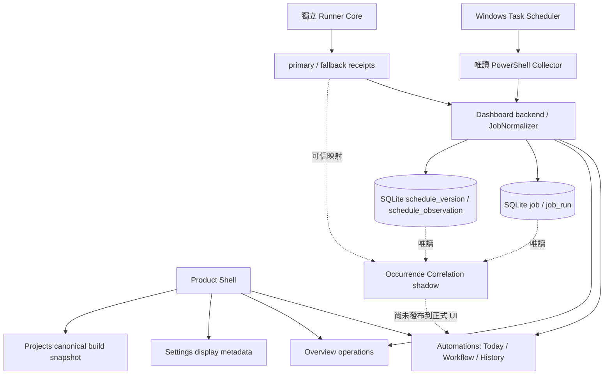

# Local Dashboard — Living Project Design

這份文件是 **Local Dashboard 自己的專案設計主檔**，供專案擁有者、GPT／Astra／Work 和未來的 Dashboard Projects Viewer 使用。它記錄為何建造、原設計、現況、重大改變、未解問題與下一步。使用者主要應由 Projects 畫面閱讀；Stage 文件與 [As-Built 現況說明](DASHBOARD-AS-BUILT-ARCHITECTURE.md) 是可追查的 evidence，不取代這份主檔。

`baseline_commit` 是歷史設計盤點所依據的 `main`，不是本文件最後提交的 SHA。`last_reviewed_at` 是設計盤點日期，不表示當天實機重新驗收所有排程或外部資料。`overall_status: IN_PROGRESS` 指**整個專案**；Feature Matrix 的 `product-projects: PARTIAL` 指 Release 1A-1 的**本專案建置快照 Viewer 最小切片**，已通過獨立初審與 Manager Review 並合併至 `main`（`9e3c8cb`）；跨專案 aggregation 與完整 Projects 閱讀面板仍未實作。Prototype 是獨立樣本畫面。Port 43871 已通過獨立初審與 Manager Review，合併至 main `eba1003`。Repository／package 核准不代表桌面目前安裝版本；實際 installed version 須由獨立 deployment evidence 驗證。Launcher／Safe Stop 的正式 source target 為 43871，非 Windows Service／installer／updater。

## Project Identity

| 項目 | 內容 |
| --- | --- |
| Project name / stable ID | Local Dashboard / `local-dashboard` |
| Purpose | 本機投資研究資料與自動化流程總控制台；讓工作、研究資料與狀態證據各有清楚來源。 |
| Repository | `Neil1031/local-dashboard` |
| Current status | `IN_PROGRESS`：Release 1B／2A／2B 已合併並完成累積部署 closeout；Release 2C Ticker Detail 已合併 main `44823ab`，尚未部署；Release 2D Reports · US Insider 已實作待管理初審，未合併／部署。SEC Transactions 維持 partial，Performance 尚未接；實際安裝狀態由獨立 deployment evidence 確認。 |
| Current design baseline | `085757affe2c2dc0c1de45663395e418ad702e3e` |

## Background

**為什麼當初建立？** 原始需求是用一個本機 Dashboard 唯讀監看 Windows Scheduled Tasks：目前是否 Ready／Running、最後一次 Scheduler 結果、下次時間，以及收集失敗時的診斷。排程散在 Windows UI，不容易同時看五個受監控工作的狀態，也不容易分清「目前可執行」與「最後一次成功」。初期以 Spring Boot、PowerShell collector、純 JavaScript 畫面建立最小可用監控路徑。

後續因為需要保留跨重啟的已觀察執行、確認實際子程序結果、追蹤排程定義版本，系統加入 SQLite History、Runner receipts、Schedule Snapshot 與唯讀 shadow correlation。使用者的研究流程又跨 US／TW 股票、報告和資料品質，因此產品定位擴大；現有排程監控成為其中的 Automations 部分。

## Original Design

**原設計：Windows Scheduled Task monitoring Dashboard。** 直接從 Scheduler 讀已選工作，以 Today 顯示目前狀態和最後／下次執行資訊。這個原始目的仍保留：排程資料只讀、錯誤顯示為錯誤、Dashboard 不創建／執行／修改 Scheduled Tasks。不能因新產品設計而把舊的監控功能或其身分語意改寫成股票來源的成功判定。

## Current Design

**目前設計：本機投資研究資料與自動化流程總控制台。** 產品設計把 Overview、Projects、Automations、US Stocks、TW Stocks、Performance、Reports、Data & Evidence、Settings 視為九個主要入口。Scheduler 只屬於 Automations 的一個資料來源；Runner 是另一種執行證據。股票來源須透過來源專案的唯讀版本化契約與 Dashboard adapter，不能讓畫面直接解讀外部 SQLite schema。

Release 1B 九頁 primary navigation 與 operations Overview 已合併 main `654fc84`；Release 2A reports Signals 已核准並合併 main `479a767`，分數明示 Imported AI report。Release 2B 在 US Stocks 新增 SEC Transactions partial 切片：同一 bounded ProcessBuilder 的固定 `--source sec` operation、獨立 API 與 UI，保留 owners、non-P、derivative、candidate／review／quality flags、footnotes、null 與 sanitized provenance。P code／candidate 只是尚未認證候選，Form 4/A amendments/corrections 不自動合併或去重；sec:<accession>:<transaction_index> 是來源位置 ID，非 immutable business-event ID。交易日、申報日、accepted time、local discovered time 分開，insider execution price 非策略進場價。Release 2C 已實作 exact ticker 的 source-separated Ticker Detail aggregate，Reports／SEC 保持獨立 envelopes、分頁、ID、日期與 provenance，無 join／dedupe／combined score／PIT；已合併 main `44823ab`，尚未部署。US Stocks 維持 PARTIAL；Ticker Detail 的 Performance 尚未接入核准唯讀來源，Release 2D Reports · All／US Insider 已接入 source-owned Reports v1，正文安全 DOM 呈現與獨立 revision 分頁，product-reports 為 PARTIAL；All 目前只有 US Insider，TW Daily／Weekly 未接；revision 為正文/hash history，無 PIT／semantic diff。TW Stocks／Performance／Data & Evidence 維持 DESIGNED，Overview 不加股票 metrics。Release 2B 已通過 Manager Review 並合併 main `4acd568`；實際安裝狀態由獨立 deployment evidence 確認。Projects 保留 Release 1A-1 最小入口；`ui/projects.mjs` 讀取建置時原樣複製的 Local Dashboard 主檔，不即時讀 Git 工作目錄。`design/prototype/` 仍是獨立靜態樣本。每個未來受管理專案應在**自己的 repository** 保存 `docs/PROJECT-DESIGN.md` 與 stable `project_id`；Dashboard 只做 viewer／aggregator，不在自己的 repo 再維護另一套該專案 status。最小 Viewer 與 prototype generator 共用 `ui/project-design.mjs` v1 parser，保留來源 repo、歷史 baseline、設計版本、SHA-256 及讀取時間；固定同站單檔來源，拒絕轉址、格式錯誤、不支援版本及超過 256 KiB 的資料。未來跨專案來源仍須另審版本化匯出。

## Goals

- 讓專案擁有者在一處看懂目前做了什麼、怎麼運作、為何改設計，以及哪些尚未完成。
- 將任務現況、執行證據、資料完整性和研究推論分開呈現；保留原始身分與不確定性。
- 用同一份 living design 支撐人類閱讀、機器讀取及未來 Projects 畫面，避免重複維護功能狀態。
- 外部投資資料以唯讀、版本化、normalized contract 接入；每個來源自行擁有其契約和設計主檔。

## Non-goals

- 不從 Dashboard 執行交易、修改股票來源正式資料、執行任意指令或替來源做投資判斷。
- 不由缺少 History／receipt 推論 production `MISSED`；不靠研究時間視窗改 Scheduler 狀態。
- Release 1A-1 僅新增正式 Projects 最小入口及固定建置資源；不修改 Scheduler task、正式 Runner config／receipt 或其他 repository。
- 不把靜態 prototype 的樣本數值當成真實投資資料、產品完成度百分比或實機驗收結果。

## Current Architecture

使用者打開正式 Dashboard 時，Today 的資料來自**當次 Scheduler 唯讀快照**；History 來自 Dashboard 曾存下的 `job_run`，不是完整 Windows Event Log。Runner receipt 由獨立 Runner Core 寫入，再由 Dashboard 唯讀檢查。Schedule Snapshot 記錄「何時看見哪版排程」；Correlation 只在明確啟用研究路徑時唯讀推算，沒有正式 UI／API，也不產生 `MISSED`。

上圖的 Runner 線表示 Dashboard 讀它的 receipts，**不是** Dashboard 啟動 Runner。`JobNormalizer` 使用完整 Scheduler task path 產生 canonical Dashboard job ID；Runner 自己的 job/profile/execution IDs 分開保存，只能經可信的 full task mapping 關聯。更完整的啟停、API、DB 和 14:30／17:00 雙 trigger 例子見 [As-Built](DASHBOARD-AS-BUILT-ARCHITECTURE.md)。

目前 Reports · All／US Insider 已是 `PARTIAL`，其他三個資料入口仍 `DESIGNED`。`product-shell` 列的「四頁」保留為 Release 1B 原切片當時限制；本輪依核准範圍不改其他 31 個 feature rows，後續 Reports 能力以 `product-reports` 及本段現況為準。

## Feature Matrix

狀態只使用 `DONE`、`PARTIAL`、`BACKEND_READY`、`DATA_READY`、`DESIGNED`、`IN_PROGRESS`、`NOT_STARTED`、`DEFERRED`、`BLOCKED`、`DROPPED`。`DONE` 是該列所寫的**現有正式能力**，不是未來頁面已上線。`BACKEND_READY` 表示核心資料／研究能力存在，但正式 viewer/API 尚未提供。`DATA_READY` 表示來源有可用資料／契約，Dashboard integration 尚未完成。`PARTIAL` 是部分能力已有，`DESIGNED` 是核准設計或已通過審查的 prototype，`IN_PROGRESS` 是實作仍在進行，`NOT_STARTED` 尚無實作，`DEFERRED` 後移，`BLOCKED` 有明確前置證據 gate，`DROPPED` 是明確不再採用。所有列都有 stable ID，供試點原型從本表產生；**不要手改產生的 status list**。

| ID | Area | Feature | Original intent | Current implementation | Status | Current limitation | Remaining work | Evidence |
| --- | --- | --- | --- | --- | --- | --- | --- | --- |
| desktop-launcher | Desktop / Runtime | Launcher | 雙擊開本機監控畫面 | 包裝版 EXE 啟動 loopback Spring server，完整驗證既有 instance 才開頁面 | DONE | 43871 已核准並合併 main `eba1003`；安裝版本須另有 deployment evidence，非 Windows Service／installer／updater | 正式部署須獨立核准並驗證 installed version／rollback | docs/WINDOWS-LAUNCHER.md |
| desktop-browser | Desktop / Runtime | Browser auto-open | 啟動後可直接看畫面 | readiness 成功後交給 Windows 預設瀏覽器 | DONE | 關瀏覽器不停止服務 | 維持 readiness 與錯誤提示 | docs/WINDOWS-LAUNCHER.md |
| desktop-stop | Desktop / Runtime | Safe Stop | 安全結束本機服務 | PID、建立時間、命令與 listener 身分核對後停止 | DONE | Windows 不保證 graceful termination；身分不明會拒絕 | 維持安全拒絕與回歸檢查 | docs/WINDOWS-SAFE-STOP.md |
| desktop-runtime | Desktop / Runtime | Bundled runtime | 使用者無須安裝 Java | app-image 內含 Java runtime 與 Dashboard JAR | DONE | 不是 installer 或 updater | 依部署 gate 更新 image | docs/WINDOWS-LAUNCHER.md |
| desktop-bootstrap | Desktop / Runtime | Config bootstrap | 首次啟動自動有監控設定 | 只在缺檔時由範本建立外部 application.yml | DONE | 已存在的空白／錯誤設定不覆寫 | 保持 create-only 與資料外置 | docs/WINDOWS-LAUNCHER.md |
| auto-collector | Automations | Scheduler Collector | 看到已選 Windows tasks 現況 | PowerShell 唯讀收集，JobNormalizer 輸出 /api/jobs | DONE | LastRunTime 只是一筆最近值，非完整事件紀錄 | 持續呈現 PARTIAL／收集錯誤 | docs/STAGE-0-1.md |
| auto-today | Automations | Today | 一眼看目前排程狀態 | 正式 UI 讀單次 /api/jobs 快照與狀態摘要 | DONE | READY 不證明今日已執行 | 保留現況與最後結果分離 | docs/STAGE-2.md |
| auto-workflow | Automations | Workflow | 看工作間的研究流程 | Today 依 metadata 顯示台／美股與依賴文字 | DONE | 只展示，不調度或阻擋下游 | 維持 Automations 搬移後的回歸，保留 Workflow 語意 | docs/STAGE-UX-2.md |
| auto-grouping | Automations | Job grouping | 找到相關排程 | 依市場／順序分組，未知工作仍顯示 | DONE | 分組不更改 Scheduler 身分 | 保留原始名稱與 ID | docs/STAGE-UX-1.md |
| auto-history | Automations | 7-day History | 追查最近工作結果 | SQLite job/job_run 與 /api/history 的七天格 | DONE | 沒刷新可能漏存較早的 LastRunTime；空格非 MISSED | 保留 evidence 與 null 語意 | docs/STAGE-3A.md; docs/STAGE-3B.md |
| auto-metadata | Automations | Metadata defaults | 讓工作名稱／用途可理解 | dashboard.mjs 依原始 TaskName 套用版本化預設 | DONE | 顯示名稱不是 task identity | 更新預設須核對來源名稱 | docs/STAGE-UX-1.md |
| auto-settings | Automations | Editable display settings | 調整顯示而不改排程 | metadata JSON 與 GET/PUT /api/settings/job-metadata | DONE | 只改畫面，不改排程或 Runner config | 維持 revision／依賴驗證 | docs/STAGE-UX-3.md |
| auto-folding | Automations | Legacy folding | 避免舊排程淹沒日常畫面 | 日期型累積檢查摺疊舊日期，legacy 可切換顯示 | DONE | 不刪除歷史或原始 job ID | 未來頁面延續展開控制 | docs/STAGE-UX-2.md |
| runner-core | Runner | Runner Core | 看見子程序真實啟動與退出 | 獨立一次性 Runner 依可信 profile 啟動 child | DONE | 只涵蓋採用 Runner 的工作 | 每個正式映射另做部署驗收 | docs/STAGE-5B.md |
| runner-receipts | Runner | Receipts | 留下執行階段證據 | STARTED／PROCESS_STARTED／TERMINAL 獨立 receipt | DONE | 缺 terminal 或未啟動 child 是不完整證據 | 維持 bounded、不可覆寫紀錄 | docs/STAGE-RUNNER-RECEIPTS-UI.md |
| runner-fallback | Runner | Primary / fallback | 主要 receipt 目錄失效仍可保留證據 | primary 寫失敗轉獨立 fallback spool | DONE | 兩處都失敗時 child 仍可能執行但無 receipt | 顯示保存失敗診斷 | docs/STAGE-5A.md |
| runner-ui | Runner | Runner UI | 在工作詳情看 Runner 結果 | /api/runner/executions 與 Today drawer 顯示最近證據 | DONE | Scheduler 結果與 child outcome 不能互代 | 保留原生 execution identity | docs/STAGE-RUNNER-RECEIPTS-UI.md |
| runner-coverage | Runner | Runner coverage | 知道哪些工作有 receipt 覆蓋 | Today 顯示映射、receipt roots 與 coverage state | DONE | MAPPED_NO_RECEIPT 不等於沒執行 | 後續加入來源新鮮度政策需另審 | docs/STAGE-RUNNER-COVERAGE-DIAGNOSTICS.md |
| runner-diagnostics | Runner | Runner diagnostics | 排查 config、profile、root 問題 | API 回傳安全裁剪的 config/root/mapping warnings | DONE | 不曝露私有路徑；不能替代原始 log | 依正式映射逐案驗收 | docs/STAGE-RUNNER-COVERAGE-DIAGNOSTICS.md |
| schedule-snapshot | Schedule semantics | Schedule Snapshot History | 保存看過的排程定義 | /api/jobs 觀察時寫 schedule_version 與 schedule_observation | BACKEND_READY | 無正式讀取 UI／API；觀察時間不是生效時間 | 設計唯讀版本檢視與空檔呈現 | docs/STAGE-SCHEDULE-SNAPSHOT-HISTORY.md |
| schedule-version | Schedule semantics | Schedule versioning | 避免以今天規則倒推舊日 | sanitized definition fingerprint 產生版本 episode | BACKEND_READY | 版本觀察間隔可能含不明修改時刻 | 將 gap 清楚顯示 | docs/STAGE-SCHEDULE-SNAPSHOT-HISTORY.md |
| schedule-correlation | Schedule semantics | Occurrence correlation shadow | 研究執行可對上哪個 trigger | 唯讀模型為支援的 trigger 產生 occurrence 並保留歧義 | BACKEND_READY | 研究 heuristics，無正式 API／UI 或 provenance guarantee | 實測來源與發佈 gate 後才考慮呈現 | docs/STAGE-OCCURRENCE-CORRELATION.md |
| schedule-availability | Schedule semantics | Machine availability evidence | 分辨漏跑與電腦／服務不可用 | 需求與研究邊界已有文件；無正式證據時間線 | NOT_STARTED | 缺 boot、sleep、service、session、條件連續性 | 建立可驗證 availability contract | docs/STAGE-SCHEDULE-SEMANTICS-MISSED-READINESS.md |
| schedule-shadow-missed | Schedule semantics | Shadow MISSED | 先以研究方式測量誤判 | Stage B 只關聯已執行證據，沒有缺席評估器 | NOT_STARTED | availability／catch-up closure 未解 | 在獨立 gate 評估 WOULD_BE_MISSED 與 UNKNOWN | docs/STAGE-SCHEDULE-SEMANTICS-MISSED-READINESS.md |
| schedule-prod-missed | Schedule semantics | Production MISSED | 可相信的自動漏跑狀態 | 正式程式不產生新 MISSED | BLOCKED | 缺真實來源證據與 shadow false-positive review | 先過 availability、provenance、shadow 與 Manager gate | docs/STAGE-OCCURRENCE-CORRELATION.md |
| product-shell | Product expansion | Product Shell | 原本只需 Today／History | Release 1B 九頁主要導覽，desktop sidebar／mobile 水平導覽，Automations／Settings 使用既有功能；已合併 main 654fc84 | PARTIAL | 四頁只有 DESIGNED 入口；新 preferences 與後續資料頁未實作，實際安裝狀態由獨立 deployment evidence 確認 | 後續來源功能另行 gate | docs/STAGE-RELEASE-1B.md |
| product-overview | Product expansion | Overview | 原本由 Today 看排程摘要 | 現有 jobs 全快照計數／未來 next run、七天已觀察 History、Runner coverage／diagnostics；Release 1B 已合併 | PARTIAL | 僅 operations；無股票 findings／freshness／reports。PARTIAL／unavailable 明示；缺 History 不推 MISSED | 跨來源 normalized feeds 後續另審 | docs/STAGE-RELEASE-1B.md |
| product-projects | Product expansion | Projects | 原設計無跨專案設計檢視 | Release 1A-1 正式入口讀本專案建置設計快照，共用 v1 parser 並呈現功能／狀態數量 | PARTIAL | 最小切片已通過獨立初審及 Manager Review，合併 main `9e3c8cb`；安裝版本須另有 deployment evidence；完整閱讀面板／跨專案 aggregation 未完成 | 後續完成完整 Projects 閱讀面板／跨專案 aggregation，後續另審與驗證 | docs/STAGE-PROJECTS-VIEWER-R1A1.md |
| product-us | Product expansion | US Stocks | 原設計只看 Insider 相關排程 | Release 2A reports Signals、2B SEC Transactions partial 已合併；2C exact ticker source-separated aggregate／獨立分頁／既有明細已實作 | PARTIAL | SEC P／candidate 尚未認證、4/A 未對帳，來源位置 ID 非 immutable event ID；相同 ticker 不推定來源關聯，不 join／dedupe／combined score；Performance 未接、跨頁非 PIT、無 freshness policy；2C 已合併 main `44823ab`、尚未部署；實際安裝狀態由獨立 deployment evidence 確認 | Performance 唯讀 contract／amendment reconciliation／PIT／broader analytics 另行 gate | docs/STAGE-RELEASE-2C.md |
| product-tw | Product expansion | TW Stocks | 原設計只看 AIStockHunter 排程 | Daily Scan／Accumulation／Candidates 已設計 | DESIGNED | AIStockHunter 尚無穩定 Dashboard-facing export | 來源 repo 另審 ai-stock-hunter-export-v1 | docs/DASHBOARD-DATA-CONTRACTS.md |
| product-performance | Product expansion | Performance | 原設計不分析選股效果 | 時距與觀測成熟度畫面已設計 | DESIGNED | 現有 performance-summary 非核准唯讀介面 | 取得來源唯讀 contract 後接入 | docs/DASHBOARD-DATA-CONTRACTS.md |
| product-reports | Product expansion | Reports | 原設計不集中報告 | Release 2D All／US Insider 使用固定 list-reports／get-report v1；日期篩選、摘要、完整安全正文與獨立 revision metadata 分頁已實作 | PARTIAL | All 僅已接入 US Insider；TW Daily／Weekly 未接；counts 為目前保留列，revision 為正文/hash history、current 可在頁外或 MISSING，無 PIT／semantic diff／歷史 ticker score；2D 待管理初審、未合併／部署 | TW 唯讀 contract、broader report sources 另行 gate | docs/STAGE-RELEASE-2D.md |
| product-evidence | Product expansion | Data & Evidence | 原設計只在工作詳情看狀態 | 原型規劃跨來源診斷、版本與 correlation | DESIGNED | Runner 診斷已存在，其他畫面未正式發佈 | 以現有證據建唯讀檢視 | docs/DASHBOARD-DESIGN-SPACE.md |

## Design Changes

日期是相關 Stage／設計 commit 的文件日期，用於理解方向改變；不是聲稱產品想法在當天首次出現。下表也是 Projects 原型 Changes timeline 的來源。

| Date | Previous design | New design | Reason | Impact | Evidence |
| --- | --- | --- | --- | --- | --- |
| 2026-09-21 | 無統一工作畫面 | Windows Scheduler Monitor | 需要集中看選定 task 的當前與最近結果 | 建立 Collector、/api/jobs、Today 的原始邊界 | docs/STAGE-0-1.md; docs/STAGE-2.md |
| 2026-09-21 | 只看 Scheduler 最近一次 | Observed execution history | 需要跨刷新／重啟查看已見的執行 | SQLite job/job_run 與七天 History；仍非完整事件紀錄 | docs/STAGE-3A.md; docs/STAGE-3B.md |
| 2026-09-26 | Scheduler 結果為主 | Runner execution evidence | Scheduler exit code 不足以驗證 child 階段 | 加入 receipt、唯讀 UI 與 coverage，保留兩套 identity | docs/STAGE-RUNNER-RECEIPTS-UI.md |
| 2026-09-26 | 只能看當前 trigger | Schedule Snapshot History | 不能以今天設定倒推歷史 | 保存版本 episode、完整／部分觀察與空檔 | docs/STAGE-SCHEDULE-SNAPSHOT-HISTORY.md |
| 2026-09-27 | 無 nominal occurrence 對照 | Occurrence Correlation shadow | 雙 trigger、晚到與版本變更不能硬配 | 唯讀生成、歧義分類；不發佈 MISSED | docs/STAGE-OCCURRENCE-CORRELATION.md |
| 2026-09-28 | 排程監控產品 | Investment Research Console | 使用者需同時理解 US／TW 研究、報告與資料品質 | Scheduler 收入 Automations；八頁產品設計與外部 adapter 邊界 | docs/DASHBOARD-DESIGN-SPACE.md |
| 2026-09-28 | 設計資訊散在 Stage／長文件 | Living Project Design pilot | 專案擁有者需要從 Projects 畫面看清現況 | 每 repo 一份主檔；本次只做 Local Dashboard 靜態試點 | docs/PROJECT-DESIGN.md |

## Major Development Issues & Lessons

只記影響架構選擇的事件；Projects Problems 畫面由本表產生。

| Issue ID | Problem | Root cause | Resolution / current state | Design lesson | State | Evidence |
| --- | --- | --- | --- | --- | --- | --- |
| runner-filesystem | Scheduler 找不到從某些 AppData 路徑部署的 Runner Java | 建立程序看到的 redirected／package AppData 視圖與 Scheduler 可見實體路徑不同 | 同一二進位在 physical path 與未重新導向測試位置成功；正式 weekly migration 當時未由該研究證明完成 | 部署前用相同 Scheduler principal 驗證實體可見性與 hashes，不用建立程序看得到來推定排程看得到 | RESOLVED IN DIAGNOSTIC | docs/STAGE-5B-R.md; docs/STAGE-5B-RETRY.md |
| runner-identity | Scheduler job ID 與 Runner native job ID 容易被誤認為同一個 | 兩套來源有不同 identity namespace | 用完整 Scheduler path 的可信 mapping 回推 Dashboard canonical ID，保留 Runner job／profile／execution ID | 不直接比較 native Runner job ID 與 Dashboard job ID | RESOLVED | docs/STAGE-OCCURRENCE-CORRELATION.md |
| missed-evidence | 無法可信宣稱某個預定時段漏跑 | LastRunTime、receipt 缺席與時間視窗都沒有 trigger-origin／可用性連續證據 | production MISSED 維持封鎖；先設計 availability、shadow 與誤判評估 gate | 不把「沒有看到」當成「沒有發生」 | BLOCKED | docs/STAGE-SCHEDULE-SEMANTICS-MISSED-READINESS.md |
| old-trigger | 舊 13:35 假設會誤導雙 trigger 配對 | 舊例子屬停用 HealthCheck，不是目前 Daily 工作 | 唯讀 inventory 與 fixture 改用 Daily 的 14:30／17:00 兩筆 weekday trigger | 用當次來源定義和版本，不從工作名稱或舊截圖猜時段 | RESOLVED | docs/SCHEDULER-SELECTION.md; docs/STAGE-OCCURRENCE-CORRELATION.md |
| absent-selection | Exact include 未命中時，缺席很容易被誤寫成 task 已刪除 | 監控範圍／權限／部分收集與真實 absence 有不同原因 | 只有完整收集、無 unmatched include、仍被選取的已知 task 才寫 ABSENT_OBSERVED；它仍不證明刪除 | 保留 PARTIAL 與觀察空檔，不把 absence 轉成 MISSED | GUARDED | docs/STAGE-SCHEDULE-SNAPSHOT-HISTORY.md |

## Known Limitations

- Production `MISSED` 仍 blocked：缺機器／Scheduler service／session 可用性、catch-up closure、trigger-origin 與 shadow false-positive evidence。
- Stage B correlation 是 shadow model，無正式 API／UI／table；`-2/+5 分鐘`、可能晚到 `3 小時`、Scheduler／Runner 合併 `30 秒` 都是研究 heuristics，不是 Windows provenance guarantee。
- Scheduler `LastRunTime` 是最近一次值，Dashboard History 是**已觀察**結果；缺一筆不等於沒執行。Schedule version 的觀察時間也不是 Windows 實際修改時間。
- Runner coverage 僅限有可信映射和可讀 receipts 的工作；缺 receipt 不代表 child 未執行。
- Insider reports Signals 已合併 main `479a767`；SEC Transactions partial 已通過 Manager Review，合併 main `4acd568`；實際安裝狀態另由 deployment evidence 確認。兩種來源與 identity 分開，不依 ticker／日期 join；來源完整性、Form 4/A 對帳及 broader analytics 尚未完成。AIStockHunter 尚無穩定 `ai-stock-hunter-export-v1`，尚未接入。`DEFAULT 0` 不等於 observed 0；`latest` artifact 不是完整性保證。
- Release 1B 九頁 Shell／operations Overview 已合併 main `654fc84`。Release 2A reports Signals 已合併 main `479a767`；Release 2B SEC Transactions partial 已合併 main `4acd568`；實際安裝狀態由獨立 deployment evidence 確認；2C 已合併 main `44823ab`、尚未部署，2D Reports · US Insider 已實作待管理初審、未合併／部署；TW Stocks／Performance／Data & Evidence 三個入口仍 DESIGNED。Projects 只有 Local Dashboard 建置快照最小入口，Release 1A-1 已通過獨立初審及 Manager Review，合併 main `9e3c8cb`；安裝版本須另有 deployment evidence；完整閱讀面板／aggregation 尚未完成，不連接其他 repo。

## Remaining Work

本表是專案層級的分類，非 production 實作授權，也不是單一巨大 TODO。`NEXT` 仍需另行核准 production stage。

| Horizon | Work | Why / gate | Evidence |
| --- | --- | --- | --- |
| NEXT | Complete Projects Viewer / remaining Release 1 implementation | Release 1A-1 最小 Viewer 已通過獨立初審及 Manager Review，合併 main `9e3c8cb`；安裝版本須另有 deployment evidence；後續完整面板／aggregation 與其他 Release 1 能力仍須獨立 gate | docs/DASHBOARD-DESIGN-SPACE.md |
| PARTIAL | Overview operations slice | 現有真實 API 已接入且 Release 1B 已合併；不含股票 metrics | docs/STAGE-RELEASE-1B.md |
| PARTIAL | US Stocks Signals／SEC Transactions／Ticker Detail | 2A／2B 已合併；2C source-separated aggregate 已合併 main `44823ab`、尚未部署，不建立跨來源 identity；Performance／4/A reconciliation／PIT／broader analytics 另審 | docs/STAGE-RELEASE-2C.md |
| PARTIAL | Reports · All／US Insider | source-owned Reports v1 固定 list/get、safe DOM Markdown／revision paging；TW 未接，無 PIT／semantic diff；2D 待審、未合併／部署 | docs/STAGE-RELEASE-2D.md |
| DESIGNED | TW Stocks／Performance | 來源版控唯讀 contract、adapter、partial/null/provenance gate | docs/DASHBOARD-DATA-CONTRACTS.md |
| DESIGNED | Data & Evidence／Schedule view | 對已保存版本與 Runner coverage 建唯讀檢視，保留 UNKNOWN | docs/STAGE-SCHEDULE-SNAPSHOT-HISTORY.md |
| BLOCKED | Production MISSED | availability、trigger provenance、shadow 誤判與獨立 Manager gate | docs/STAGE-SCHEDULE-SEMANTICS-MISSED-READINESS.md |
| LATER | Tray／auto-start／updater | 包裝與 rollback/security review，並非此 pilot 範圍 | docs/DASHBOARD-DESIGN-SPACE.md |

## Important Files / APIs / DB

| 類型 | 名稱 | 用途 |
| --- | --- | --- |
| UI | `index.html`、`dashboard.mjs`、`ui/projects.mjs`、`ui/shell.mjs`、`ui/overview.mjs`、`ui/us-signals.mjs`、`ui/us-sec-transactions.mjs`、`ui/us-stocks.mjs` | 九頁 Shell、operations Overview、Automations／Settings、Projects 最小入口及分開的 reports Signals／SEC Transactions 切片 |
| Resource / parser | `/project-design/PROJECT-DESIGN.md`、`ui/project-design.mjs` | canonical 建置快照／共用 v1 契約，不是 live Git reader |
| Prototype | `design/prototype/` | 九頁靜態產品樣本；Projects 由本文件生成資料 |
| API | `/api/jobs` | 當次 Scheduler snapshot 與收集診斷 |
| API | `/api/history` | SQLite 已觀察 execution history |
| API | `/api/runner/executions` | Runner receipts 與 coverage |
| API | `/api/settings/job-metadata` | 顯示設定的讀取／更新 |
| API | `/api/us/signals` | 固定 Insider reports contract v1 的唯讀 adapter，不直接解讀外部 SQLite |
| API | `/api/us/sec-transactions` | 固定 Insider sec contract v1，保留 source-position identity 與 transaction uncertainty |
| API | `/api/reports/us-insider`、`/api/reports/us-insider/detail` | 固定 Reports v1 list/get、no-store、bounded 日期／獨立分頁；正文只在 detail |
| API | `/api/us/ticker-detail` | required exact ticker，既有 reports／SEC envelopes 分開聚合、獨立 bounded pagination；不推定來源關聯 |
| DB | `job`、`job_run` | 已知 Scheduler 工作與已觀察完成執行 |
| DB | `schedule_version`、`schedule_observation` | 排程定義 episode 與 presence 觀察 |
| Config | `config/application.yml` | 外部 runtime 監控清單等設定；缺檔時 create-only bootstrap |
| Code | `OccurrenceCorrelation.java` | 唯讀 shadow 研究模型，無正式 endpoint |

## Evidence Links

- **Release 1B：** [九頁 Shell／operations Overview／搬移驗證](STAGE-RELEASE-1B.md)；已合併 main `654fc84`，實際安裝狀態由獨立 deployment evidence 確認。
- **Release 2A：** [US Stocks reports Signals 唯讀切片](STAGE-RELEASE-2A.md)；已合併 main `479a767`，實際安裝狀態由獨立 deployment evidence 確認。
- **Release 2B：** [SEC Transactions partial 切片](STAGE-RELEASE-2B.md)；已通過 Manager Review 並合併 main `4acd568`；實際安裝狀態由獨立 deployment evidence 確認。
- **Release 2C：** [Ticker Detail source-separated aggregate](STAGE-RELEASE-2C.md)；已合併 main `44823ab`、尚未部署；Performance 尚未接入唯讀來源。
- **Release 2D：** [Reports · US Insider](STAGE-RELEASE-2D.md)；固定 source-owned list/get、正文安全呈現、獨立 revision 分頁；待管理初審、未合併／部署。

- **現況如何運作：** [DASHBOARD-AS-BUILT-ARCHITECTURE.md](DASHBOARD-AS-BUILT-ARCHITECTURE.md)。可追查既有系統及已審查合併的 Release 1A-1 最小 Viewer；後續若修改現況說明，需同步檢查本主檔，保留歷史來源與驗證界線。
- **產品空間與九頁方向：** [DASHBOARD-DESIGN-SPACE.md](DASHBOARD-DESIGN-SPACE.md)；[資料契約](DASHBOARD-DATA-CONTRACTS.md)。
- **Runner：** [receipt UI](STAGE-RUNNER-RECEIPTS-UI.md)、[coverage diagnostics](STAGE-RUNNER-COVERAGE-DIAGNOSTICS.md)、[Scheduler 路徑可見性研究](STAGE-5B-R.md)。
- **排程版本與關聯：** [Schedule Snapshot History](STAGE-SCHEDULE-SNAPSHOT-HISTORY.md)、[Occurrence Correlation](STAGE-OCCURRENCE-CORRELATION.md)、[MISSED readiness](STAGE-SCHEDULE-SEMANTICS-MISSED-READINESS.md)。
- **既有畫面：** [Today 接線](STAGE-2.md)、[History](STAGE-3B.md)、[Workflow／摺疊](STAGE-UX-2.md)、[可編輯設定](STAGE-UX-3.md)。

## Change Log

| Date | Design version | Change | Review state |
| --- | --- | --- | --- |
| 2026-09-28 | 1 | 建立並審核 Local Dashboard Living Project Design pilot；彙整 As-Built、Design Space、feature status、重大問題與待辦分類，供 Projects 靜態原型讀取。 | Manager Review PASSED |
| 2026-09-30 | 1 | Release 1A-1：Projects 本專案建置快照最小入口，33 IDs 保留，僅 product-projects DESIGNED → PARTIAL；目標 Port 已定 43871，現行程式 8080 未遷移。 | Implementation ready for Astra / Manager review; not deployed |
| 2026-09-30 | 1 | Release 1A-1 已通過初審及 Manager Review，保留歷史合併至 main `9e3c8cb`；後續專用分支整合舊來源 43871，補完整啟動重用身分門檻並驗證隔離候選。33 IDs／status counts 不變，正式安裝／捷徑未替換。 | Port candidate awaiting independent first review / Manager Review; not deployed |
| 2026-10-01 | 1 | Release 1B：九頁 Shell、來源有據的 operations Overview、Automations／Settings 搬移；33 IDs 保留，僅 product-shell／product-overview DESIGNED → PARTIAL。installed app 未變更。 | READY_FOR_MANAGER_REVIEW; not merged / deployed |
| 2026-10-01 | 1 | Release 2B：US Stocks 新增 SEC Transactions partial，保留 nullable transaction facts、owners、non-P／derivative、footnotes、candidate／review／amendment uncertainty；不做 Form 4/A reconciliation。33 IDs／status counts 不變，product-us 維持 PARTIAL，installed app 未變更。 | READY_FOR_MANAGER_REVIEW; not merged / deployed |
| 2026-10-01 | 1 | Release 2C：US Stocks Ticker Detail 以 required exact ticker 分別聚合既有 Reports／SEC，獨立狀態／分頁／明細；不 join／dedupe／combined score，Performance 未接、4/A／PIT 仍未完成。33 IDs／status counts 不變，product-us 維持 PARTIAL；本輪未部署。 | Development complete; awaiting management review; not merged / deployed |
| 2026-10-01 | 1 | Release 2D：Reports · All／US Insider 接入 source-owned list/get v1、exact date、完整安全正文與 revision metadata 分頁；TW 未接、無 PIT／semantic diff。33 IDs 保留，只有 product-reports DESIGNED→PARTIAL。2C current wording 同步已合併 main 44823ab；本輪未部署。 | Development complete; awaiting management review; not merged / deployed |
