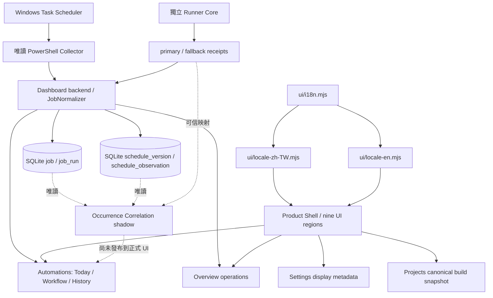

# Local Dashboard — Living Project Design

這份文件是 **Local Dashboard 自己的專案設計主檔**，供專案擁有者、GPT／Astra／Work 和未來的 Dashboard Projects Viewer 使用。它記錄為何建造、原設計、現況、重大改變、未解問題與下一步。使用者主要應由 Projects 畫面閱讀；Stage 文件與 [As-Built 現況說明](DASHBOARD-AS-BUILT-ARCHITECTURE.md) 是可追查的 evidence，不取代這份主檔。

`baseline_commit` 是歷史設計盤點所依據的 `main`，不是本文件最後提交的 SHA。`last_reviewed_at` 是設計盤點日期，不表示當天實機重新驗收所有排程或外部資料。`overall_status: IN_PROGRESS` 指**整個專案**；Feature Matrix 的 `product-projects: PARTIAL` 指 Release 1A-1 的**本專案建置快照 Viewer 最小切片**，已通過獨立初審與 Manager Review 並合併至 `main`（`9e3c8cb`）；跨專案 aggregation 與完整 Projects 閱讀面板仍未實作。Prototype 是獨立樣本畫面。Port 43871 已通過獨立初審與 Manager Review，合併至 main `eba1003`。Repository／package 核准不代表桌面目前安裝版本；實際 installed version 須由獨立 deployment evidence 驗證。Launcher／Safe Stop 的正式 source target 為 43871，非 Windows Service／installer／updater。

## Project Identity

| 項目 | 內容 |
| --- | --- |
| Project name / stable ID | Local Dashboard / `local-dashboard` |
| Purpose | 本機投資研究資料與自動化流程總控制台；讓工作、研究資料與狀態證據各有清楚來源。 |
| Repository | `Neil1031/local-dashboard` |
| Current status | `IN_PROGRESS`：Release 1B／2A／2B 已合併並完成累積部署 closeout；Release 2C Ticker Detail 已合併 main `44823ab`，已完成核准累積部署；Release 2D Reports · US Insider 已核准合併並完成累積部署。SEC Transactions 維持 partial；獨立 Performance v1 實作已獲 Manager 核准、已整合 main `d69ff5ab` 並完成核准正式部署，Ticker Detail 未整合 Performance；實際安裝狀態由獨立 deployment evidence 確認。 |
| Current design baseline | `085757affe2c2dc0c1de45663395e418ad702e3e` |

## Background

**為什麼當初建立？** 原始需求是用一個本機 Dashboard 唯讀監看 Windows Scheduled Tasks：目前是否 Ready／Running、最後一次 Scheduler 結果、下次時間，以及收集失敗時的診斷。排程散在 Windows UI，不容易同時看五個受監控工作的狀態，也不容易分清「目前可執行」與「最後一次成功」。初期以 Spring Boot、PowerShell collector、純 JavaScript 畫面建立最小可用監控路徑。

後續因為需要保留跨重啟的已觀察執行、確認實際子程序結果、追蹤排程定義版本，系統加入 SQLite History、Runner receipts、Schedule Snapshot 與唯讀 shadow correlation。使用者的研究流程又跨 US／TW 股票、報告和資料品質，因此產品定位擴大；現有排程監控成為其中的 Automations 部分。

## Original Design

**原設計：Windows Scheduled Task monitoring Dashboard。** 直接從 Scheduler 讀已選工作，以 Today 顯示目前狀態和最後／下次執行資訊。這個原始目的仍保留：排程資料只讀、錯誤顯示為錯誤、Dashboard 不創建／執行／修改 Scheduled Tasks。不能因新產品設計而把舊的監控功能或其身分語意改寫成股票來源的成功判定。

## Current Design

**目前設計：本機投資研究資料與自動化流程總控制台。** 產品設計把 Overview、Projects、Automations、US Stocks、TW Stocks、Performance、Reports、Data & Evidence、Settings 視為九個主要入口。Scheduler 只屬於 Automations 的一個資料來源；Runner 是另一種執行證據。股票來源須透過來源專案的唯讀版本化契約與 Dashboard adapter，不能讓畫面直接解讀外部 SQLite schema。

Release 1B 九頁 primary navigation 與 operations Overview 已合併 main `654fc84`；Release 2A reports Signals 已核准並合併 main `479a767`，分數明示 Imported AI report。Release 2B 在 US Stocks 新增 SEC Transactions partial 切片：同一 bounded ProcessBuilder 的固定 `--source sec` operation、獨立 API 與 UI，保留 owners、non-P、derivative、candidate／review／quality flags、footnotes、null 與 sanitized provenance。P code／candidate 只是尚未認證候選，Form 4/A amendments/corrections 不自動合併或去重；sec:<accession>:<transaction_index> 是來源位置 ID，非 immutable business-event ID。交易日、申報日、accepted time、local discovered time 分開，insider execution price 非策略進場價。Release 2C 已實作 exact ticker 的 source-separated Ticker Detail aggregate，Reports／SEC 保持獨立 envelopes、分頁、ID、日期與 provenance，無 join／dedupe／combined score／PIT；已合併 main `44823ab`，已完成核准累積部署。US Stocks 維持 PARTIAL；Ticker Detail 尚未整合 Performance；獨立 Performance v1 已核准為 PARTIAL，Release 2D Reports · All／US Insider 已接入 source-owned Reports v1，正文安全 DOM 呈現與獨立 revision 分頁，product-reports 為 PARTIAL；All 已實作 US Insider／TW Daily／TW Weekly 三個獨立區域，TW consumer 已核准並整合／部署於 main 7a2f9c45；revision 為正文/hash history，無 PIT／semantic diff。TW Stocks v1 已通過 Manager 實作核准，`product-tw` 為 PARTIAL，已整合 main `bce84c4` 並完成核准累積部署；Performance v1 為 PARTIAL，Data & Evidence Taiwan v1 已核准為 PARTIAL，Overview 不加股票 metrics。Release 2B 已通過 Manager Review 並合併 main `4acd568`；實際安裝狀態由獨立 deployment evidence 確認。Projects 保留 Release 1A-1 最小入口；`ui/projects.mjs` 讀取建置時原樣複製的 Local Dashboard 主檔，不即時讀 Git 工作目錄。`design/prototype/` 仍是獨立靜態樣本。每個未來受管理專案應在**自己的 repository** 保存 `docs/PROJECT-DESIGN.md` 與 stable `project_id`；Dashboard 只做 viewer／aggregator，不在自己的 repo 再維護另一套該專案 status。最小 Viewer 與 prototype generator 共用 `ui/project-design.mjs` v1 parser，保留來源 repo、歷史 baseline、設計版本、SHA-256 及讀取時間；固定同站單檔來源，拒絕轉址、格式錯誤、不支援版本及超過 256 KiB 的資料。未來跨專案來源仍須另審版本化匯出。

### Localization / i18n v1 cross-cutting capability

Localization / i18n v1 實作 `f960723ddcdeec925ef2e8b40035cd28ac74bae1` 已獲 Manager 核准，Design Sync、main `95f025dc1c0675e056cc78db1061c25078b66f6e` 整合與完整套件部署均已完成，部署後 STOPPED。既有 operational packet／Owner Doc 保存安裝身分。Localization 不新增 feature ID；33 stable IDs／status counts 保持 DONE 19、PARTIAL 8、BACKEND_READY 3、NOT_STARTED 2、BLOCKED 1，其餘 0。本次 Taiwan History / Range consumer e52a4be 已核准；下一 Stage Taiwan Performance NOT STARTED。

共享 flat resource flow 為 `ui/i18n.mjs` → `ui/locale-zh-TW.mjs`／`ui/locale-en.mjs` → 九個既有 owner-facing UI 區域。i18n原切片每語系1,066keys；本次History新增26keys後現行1,092keys，exact key／named placeholder parity；預設 zh-TW，替代 en。偏好僅存 browser localStorage `local-dashboard.locale.v1`；缺值／無效值／read failure 使用 in-memory zh-TW，write failure 安全退回 zh-TW。沒有 backend locale state、application.yml locale setting、DB locale state或外部翻譯服務。

Dashboard-owned chrome、固定表單／提示／狀態／aria-label／placeholder 使用共享文字層；source-owned report Markdown、company/security names、AI free-text、configured job/display metadata、canonical Project Design body、IDs、hashes、timestamps與provenance保留原值。Known machine codes 可顯示在地化解釋並保留 exact raw code；unknown future codes 仍 raw。翻譯只用 textContent／allowlisted text attributes，不插入 translation HTML。

語系切換只更新 held presentation，保留當前 page／subpage、filters、pagination、open dialogs／details、focus及已載入資料；不 navigate、reload、show/load/refresh、refetch、restart server或改 query／business semantics。Project Design parser／來源內容與 source identity、null／UNKNOWN／PARTIAL等語意保持不變。

部署後每個新增 Dashboard-owned owner-facing UI string 必須使用 common i18n layer；新 key 在同一修改加入 zh-TW／en及相同 named placeholders，UI 修改執行 parity／coverage及相關 browser regression。持久規則見 root `AGENTS.md`。歷史參考 `chore/i18n-seed` 保持 `15e9c5c807ffc11e9039c6c60a68c4373f350a58`；不 merge／rebase／cherry-pick，production canonical是兩份 reviewed `ui/locale-*.mjs`，不是 seed。

### TW Stocks v1 current consumer slice

核准實作為 `e2bbbd85e6f3f5ac9464e8f0af688c64cc7113a0`，parent／本輪 main 基準為 `9392949d90c0cc0f1f6defb4e9375e4b64f643e2`；**implementation approved / MERGED main bce84c4 / cumulative deployment complete**。資料流是 Taiwan Volume Watch → source-owned `tw-daily-accumulation-v1` → 固定 `TaiwanStocksAdapter` ProcessBuilder → bounded `/api/tw/stocks` → `ui/tw-stocks.mjs`。來源擁有契約、run/date binding 與業務語意；Dashboard 不直接讀它的 private SQLite schema、journal、latest*.json 或 internal tables。

七區為 source/snapshot state、Daily Observation、accumulation/readiness、source completeness、candidates/watchlist、responsibility、Weekly Check。首次進頁只載入一次 latest，explicit Refresh／exact date／Latest；無 polling，loading／失敗清除舊畫面，PARTIAL 保留有效 facts，candidate dialog 支援窄螢幕與鍵盤。COHERENT 不等於 business SUCCESS；PARTIAL 不等於 SUCCESS、UNKNOWN 不等於 NO、null 不等於 0。WARMING_UP 的 0 candidates 不代表沒有異常；latest attempt 與 latest finalized 分開，weekly FAILED 可與可用 daily observation 共存。

Taiwan canonical main `1406ff78d40a748ed9edaada8802354514df593c` 與已部署 Stage 2 image `dad7b4978a4a15823abef641f9440d07bfc0fe11` 是不同 provenance；已安裝 Git checkout 有預期 dirty state，不能稱為 clean main 或等同整份 deployment image。僅一次正式 candidate-runtime GET 的 captured evidence 為 200/no-store/PARTIAL、target 2026-10-02、daily PARTIAL/WARMING_UP、0 candidates、獨立 latest attempt、weekly FAILED/來源明示 SELECTED_RESULT；這是 consumer compatibility PASS，非自然 writer／市場完整性／無異常／建議／未來穩定性／installed Dashboard 驗收。API、exit 2、privacy 與剩餘限制見 [Data Contracts](DASHBOARD-DATA-CONTRACTS.md#tw-stocks-v1-implemented-consumer) 與 [Stage evidence](STAGE-TW-STOCKS-V1.md)。前次 Performance 累積部署已安裝 main d69ff5ab 的 Projects 建置快照；前次 TW Reports 已從 main 7a2f9c45 建置／部署；前次Evidence已從main c269fe72建置／部署；Projects仍讀取installed建置快照，reload不讀Git工作目錄。

### Release 3A Performance v1 current consumer slice

核准實作 `96b15c8caf0ed0fc64e307a77c95de3e460e20ce`，implementation direct parent／當時 main `bce84c4506e3e94d7b69eac6bf92679d1f1fd49d`；**implementation approved / MERGED main d69ff5ab / production deployment complete**。`product-performance` 是 PARTIAL，僅接 current active Insider AI-report signals。來源 main `231638f2efaed69755f1534a4c651630afaf896a`／Performance contract merge `fdd7fa5e0dc762d130c86a3c980863be29eeb392` 擁有 v1 identity／status／snapshots／returns。資料流為 Insider → 固定 source-owned `read-performance-summary`／`list-performance`／`get-performance` → `PerformanceAdapter` → bounded normalized APIs → `ui/performance.mjs`。舊 writer-routed `performance-summary` 禁止使用；Dashboard 不開外部 SQLite、不 init/migrate、不刷新價格／計算或更新績效。

Summary 保留五桶 `<85`／`85-89`／`90-94`／`95+`／`UNSCORED`；0 return 是 observed、不是 win，UNSCORED 是 null Investment Score，observed=0 的平均與勝率是 null。List 預設 3m，五時距 1d／1w／1m／3m／6m、exact case-sensitive ticker 不 trim／normalize，有限 Previous／Next、無 auto-fetch-all／跨呼叫 PIT。`report:<report_date>:<ticker>` 保留不同報告日的獨立來源身分；`horizonObserved` 只代表 snapshot 存在，可含 null return。Detail 原樣保留 COMPLETE／PARTIAL／PENDING／NOT_COMPUTED、missingSessions、nullable／zero metrics、snapshots、provider／priceBasis 及兩種 return basis；不從價格推算。COMPLETE 僅代表 stored asOf 視窗內無已知 completed-session gap 且有 usable entry，不保證未來時距成熟／獲利；PARTIAL 有來源 gaps，PENDING 是來源等待時間，無 performance row 是 NOT_COMPUTED、不自動轉 PENDING。

來源 methodology：discovery 是假定發布前上一個已完成 regular-session close proxy；next tradable 是發布時或之後第一個 regular-session open。1d close/open，1w 是 +7 calendar days target 當日或之後第一個 session，1m／3m／6m 是 calendar-month target 當日或之後第一個 session。Yahoo OHLC `split_adjusted_ex_dividends` 不含股息／費用／稅／slippage；daily bars 不證明 intraday order 或真實成交。這是 stored research evidence，不是 realized portfolio return。分數為 current imported AI-report score，沒有歷史 PIT reconstruction；重複 report signals 可能相關，不能稱為 independent trades。無 confidence interval／Sharpe／CAGR／annualization／expected return／recommendation。

唯一核准 formal compatibility set 的既有 captures：3m summary＋3m list limit1/offset0＋selected exact CRESY detail；32 active，桶數 14／14／4／0／0，3m observed 0／32、平均／勝率 null，stored NOT_COMPUTED32、其他0；detail 無 snapshots／metrics null。Consumer compatibility PASS，不是 0% performance、strategy success/failure、完整歷史／成熟 3m／獨立交易／portfolio／recommendations／installed acceptance。本輪只用既有 captures。API／shared transport／完整語意见 [Data Contracts](DASHBOARD-DATA-CONTRACTS.md#release-3a-implemented-performance-v1)，核准測試與 captures 見 [Stage evidence](STAGE-RELEASE-3A-PERFORMANCE.md)。Ticker Detail 本身尚未整合 Performance；Taiwan／SEC／broader analytics／PIT／portfolio／backtesting／recommendations／trading 保留未完成。

### TW Reports v1 current consumer slice

Manager 核准實作 `93ae8859d04dbc399742714d61ba002363095b6b`，direct parent／本次 reviewed main `d69ff5ab10d637335b9bf9e0c558bd07aa267883`；前次 consolidated Design Sync／main 7a2f9c45 整合／production deployment 已完成。Taiwan canonical main `95071c2b9383a8d143dcfd107edd2d1050130462` 與正式 112-asset runtime 分別核對，不將 dirty installed Git HEAD 當部署身分。`product-tw`／`product-reports` 維持 PARTIAL。

Taiwan Volume Watch → source-owned `tw-reports-v1` → 固定 `TaiwanReportsAdapter` → 獨立 `TwReportsProjection` → no-store `/api/reports/tw` + `/api/reports/tw/detail` → Reports / TW Daily + TW Weekly。明確 `reports-cli-path` 與 Stage 2 `cli-path` 分開，沿用既有 enabled／Python／DB／output／timeout；TW Stocks 與 TW Reports 共用原 Taiwan Semaphore2。READY／EMPTY=exit0，合法 PARTIAL／UNAVAILABLE／ERROR=exit2；保存 Weekly FAILED 是業務狀態，不是 transport failure。

Daily／Weekly 保留獨立 authority、run/date／report IDs、warnings／provenance、null／UNKNOWN／保存總數與匯出截斷。All 分別呈現 US Insider／TW Daily／TW Weekly，狀態、分頁、明細與責任各自獨立，不合成跨來源 timeline／total／PIT snapshot。安全 DOM Markdown／native dialog 保留，最新 matching response 才能呈現；browser abort 不證明 source cancellation。null 不等於 0、UNKNOWN 不等於 NO、WARMING_UP＋0 candidates 不代表無異常，來源 anomaly score 不是 investment score。

既有唯一 consumer compatibility set 為四次 LIST returned exact ID → DETAIL：Daily READY→PARTIAL／WARMING_UP／0；Weekly READY→PARTIAL／saved FAILED／pending164匯出100。只證明 consumer compatibility，非自然排程成功、完整歷史／市場或投資有效性。本次只重用 captures，不重讀正式來源。History/Range consumer已核准；Taiwan Performance／Data & Evidence broader aggregation／broader research analytics仍未完成；完整語意見 [Data Contracts](DASHBOARD-DATA-CONTRACTS.md#tw-reports-v1-implemented-consumer)，核准驗證與歷史 evidence 見 [Stage](STAGE-TW-REPORTS-V1.md)。

### Taiwan Data & Evidence v1 current consumer slice

Taiwan Data & Evidence v1 實作 `04f67e9c41085b7ff196b50eac1ca331251cb2d7`、Design Sync `243870a5`、main `c269fe720678a045bef9bf328df84bd4dd32b211` 整合與前次正式部署均已完成；此為既有 closeout 結果，不是本次新增 formal observation或自然使用驗收。只將 `product-evidence` DESIGNED→PARTIAL，33 stable IDs 與其他32 statuses 保留；product-tw／product-reports／product-performance 仍 PARTIAL。Taiwan-only 第一切片不是整個跨來源 Evidence 完成，Schedule Versions／Correlation／Runner aggregation 仍未接入。

Taiwan Volume Watch source-owned `tw-daily-accumulation-v1`／`tw-reports-v1` → 既有 `TaiwanStocksAdapter`／`TwStocksProjection` 與 `TaiwanReportsAdapter`／`TwReportsProjection` → 既有 normalized Dashboard APIs → `ui/evidence.mjs`（重用 `readTwStocks`／`readTwReports`）→ Data & Evidence Taiwan v1。沒有新 source contract／backend adapter／projection，不直讀 Taiwan SQLite／file／private schema；沒有新的 Dashboard persistence／backend cache，沒有 report DETAIL fetch、aggregate health／trust／investment score 或 cross-source atomic／PIT interpretation。

Wave 1：`GET /api/tw/stocks`；只有 fetch＋JSON body 實際 settled 後，Wave 2 才並行讀 `GET /api/reports/tw?type=daily&limit=1&offset=0` 與 `GET /api/reports/tw?type=weekly&limit=1&offset=0`。Evidence-owned unresolved Taiwan browser request 最大2；single drain loop、generation matching 與 newest refresh coalescing，Refresh 立即作廢舊 presentation，等舊 reads 實際 drain 再處理 newest generation（即使忽略 abort）。離頁阻止 stale render／pending cache，已完成 view 返回可重用 browser completed cache；無 polling。此 browser-local presentation cache 不是新增 backend persistence/cache；AbortController 不保證 server／source child process universal cancellation，也不宣稱跨其他頁面／clients 的全域 budget。

COHERENT != SUCCESS；PARTIAL != SUCCESS；UNKNOWN != NO；null != 0；WARMING_UP＋0 candidates != no anomaly；candidate != buy；source anomaly score != investment score。Weekly FAILED 是保存的週檢業務狀態，不抹除 Daily availability。latest attempt != latest finalized；Daily observation identity != Daily report identity != Weekly report identity。bounded LIST first item 不代表 complete historical latest，除非 source contract 明確建立該語意。三張來源卡片保留獨立 dataState／contract／observedAt／generatedAt／selected ID／warnings；envelope 與 item warnings／times 分開。Daily query／snapshot／scope、attempt／finalized、completeness／readiness／responsibility 與 Weekly Check 分開，missing facts 不補成零；LIST problemCount 不代替完整 DETAIL，細節由 Reports 頁負責。

本輪沒有新的 formal Taiwan compatibility read。只可重用 frozen normalized captures：Stocks observed `2026-10-02T17:04:23.118012500Z`、selected `2026-10-02`、run `e801318d154a46c88f03858a9b60044c`、PARTIAL；Daily LIST observed `2026-10-03T12:17:45.674272100Z`、READY、`tw-daily:2026-10-02:f93460ffdd3d4ec6a60ce1244ce30d0f`；Weekly LIST observed `2026-10-03T12:17:46.080439900Z`、READY／saved FAILED、`tw-weekly:2026-10-02:510f722b6bcd40c09cee9393594be39e`。Replay 仍標為 SAVED_TEST_EVIDENCE，原始 bytes／時間／狀態／ID 不改，不稱新 observations 或 installed acceptance。

Localization / i18n v1 已完成實作核准、Design Sync、main95f025dc1c0675e056cc78db1061c25078b66f6e整合及部署，最後STOPPED；不將安裝身分當自然使用驗收。本次Taiwan History / Range consumer已核准，下一Taiwan Performance NOT STARTED；33 IDs／status counts不改。

完整實作／Self-QA／限制見 [Stage evidence](STAGE-TW-DATA-EVIDENCE-V1.md)。

## Goals

- 讓專案擁有者在一處看懂目前做了什麼、怎麼運作、為何改設計，以及哪些尚未完成。
- 將任務現況、執行證據、資料完整性和研究推論分開呈現；保留原始身分與不確定性。
- 用同一份 living design 支撐人類閱讀、機器讀取及未來 Projects 畫面，避免重複維護功能狀態。
- 外部投資資料以唯讀、版本化、normalized contract 接入；每個來源自行擁有其契約和設計主檔。

## Non-goals

- 不從 Dashboard 執行交易、修改股票來源正式資料、執行任意指令或替來源做投資判斷。
- 不由缺少 History／receipt 推論 production `MISSED`；不靠研究時間視窗改 Scheduler 狀態。
- Release 1A-1 僅新增正式 Projects 最小入口及固定建置資源；不修改 Scheduler task、正式 Runner config／receipt 或其他 repository。
- 不把靜態 prototype 的樣本數值當成真實投資資料、產品完成度百分比或實機驗收結果。

## Current Architecture

共享 presentation layer為 `ui/i18n.mjs` → `ui/locale-zh-TW.mjs`／`ui/locale-en.mjs` → 九區既有UI；每語系1,066 keys，zh-TW default／en，browser-local preference，沒有backend/config/DB locale state。Locale變更只更新held presentation，不讀來源、不改query／page／filters／paging／focus／dialogs；來源內容與machine identity保持原樣。

使用者打開正式 Dashboard 時，Today 的資料來自**當次 Scheduler 唯讀快照**；History 來自 Dashboard 曾存下的 `job_run`，不是完整 Windows Event Log。Runner receipt 由獨立 Runner Core 寫入，再由 Dashboard 唯讀檢查。Schedule Snapshot 記錄「何時看見哪版排程」；Correlation 只在明確啟用研究路徑時唯讀推算，沒有正式 UI／API，也不產生 `MISSED`。

上圖的 Runner 線表示 Dashboard 讀它的 receipts，**不是** Dashboard 啟動 Runner。`JobNormalizer` 使用完整 Scheduler task path 產生 canonical Dashboard job ID；Runner 自己的 job/profile/execution IDs 分開保存，只能經可信的 full task mapping 關聯。更完整的啟停、API、DB 和 14:30／17:00 雙 trigger 例子見 [As-Built](DASHBOARD-AS-BUILT-ARCHITECTURE.md)。

目前 Reports · All／US Insider／TW Daily／TW Weekly 與 TW Stocks v1 均為 `PARTIAL`，Performance v1 為 `PARTIAL`；Data & Evidence Taiwan v1 為 `PARTIAL`。`product-shell` 列的「四頁」保留為 Release 1B 原切片當時限制。前次 Performance Design Sync 僅將 `product-performance` DESIGNED→PARTIAL；前次 TW Reports Design Sync 保留所有 33 IDs／statuses；前次僅 product-evidence DESIGNED→PARTIAL；本次 History / Range Design Sync 不新增 ID 或變更任何 status。2C／2D／TW 的 active wording 同步已完成的核准累積部署，三者仍 PARTIAL。parser-derived counts 為 DONE 19、PARTIAL 8、BACKEND_READY 3、DATA_READY 0、DESIGNED 0、IN_PROGRESS 0、NOT_STARTED 2、DEFERRED 0、BLOCKED 1、DROPPED 0。

## Feature Matrix

狀態只使用 `DONE`、`PARTIAL`、`BACKEND_READY`、`DATA_READY`、`DESIGNED`、`IN_PROGRESS`、`NOT_STARTED`、`DEFERRED`、`BLOCKED`、`DROPPED`。`DONE` 是該列所寫的**現有正式能力**，不是未來頁面已上線。`BACKEND_READY` 表示核心資料／研究能力存在，但正式 viewer/API 尚未提供。`DATA_READY` 表示來源有可用資料／契約，Dashboard integration 尚未完成。`PARTIAL` 是部分能力已有，`DESIGNED` 是核准設計或已通過審查的 prototype，`IN_PROGRESS` 是實作仍在進行，`NOT_STARTED` 尚無實作，`DEFERRED` 後移，`BLOCKED` 有明確前置證據 gate，`DROPPED` 是明確不再採用。所有列都有 stable ID，供試點原型從本表產生；**不要手改產生的 status list**。

| ID | Area | Feature | Original intent | Current implementation | Status | Current limitation | Remaining work | Evidence |
| --- | --- | --- | --- | --- | --- | --- | --- | --- |
| desktop-launcher | Desktop / Runtime | Launcher | 雙擊開本機監控畫面 | 包裝版 EXE 啟動 loopback Spring server，完整驗證既有 instance 才開頁面 | DONE | 43871 已核准並合併 main `eba1003`；安裝版本須另有 deployment evidence，非 Windows Service／installer／updater | 正式部署須獨立核准並驗證 installed version／rollback | docs/WINDOWS-LAUNCHER.md |
| desktop-browser | Desktop / Runtime | Browser auto-open | 啟動後可直接看畫面 | readiness 成功後交給 Windows 預設瀏覽器 | DONE | 關瀏覽器不停止服務 | 維持 readiness 與錯誤提示 | docs/WINDOWS-LAUNCHER.md |
| desktop-stop | Desktop / Runtime | Safe Stop | 安全結束本機服務 | PID、建立時間、命令與 listener 身分核對後停止 | DONE | Windows 不保證 graceful termination；身分不明會拒絕 | 維持安全拒絕與回歸檢查 | docs/WINDOWS-SAFE-STOP.md |
| desktop-runtime | Desktop / Runtime | Bundled runtime | 使用者無須安裝 Java | app-image 內含 Java runtime 與 Dashboard JAR | DONE | 不是 installer 或 updater | 依部署 gate 更新 image | docs/WINDOWS-LAUNCHER.md |
| desktop-bootstrap | Desktop / Runtime | Config bootstrap | 首次啟動自動有監控設定 | 只在缺檔時由範本建立外部 application.yml | DONE | 已存在的空白／錯誤設定不覆寫 | 保持 create-only 與資料外置 | docs/WINDOWS-LAUNCHER.md |
| auto-collector | Automations | Scheduler Collector | 看到已選 Windows tasks 現況 | PowerShell 唯讀收集，JobNormalizer 輸出 /api/jobs | DONE | LastRunTime 只是一筆最近值，非完整事件紀錄 | 持續呈現 PARTIAL／收集錯誤 | docs/STAGE-0-1.md |
| auto-today | Automations | Today | 一眼看目前排程狀態 | 正式 UI 讀單次 /api/jobs 快照與狀態摘要 | DONE | READY 不證明今日已執行 | 保留現況與最後結果分離 | docs/STAGE-2.md |
| auto-workflow | Automations | Workflow | 看工作間的研究流程 | Today 依 metadata 顯示台／美股與依賴文字 | DONE | 只展示，不調度或阻擋下游 | 維持 Automations 搬移後的回歸，保留 Workflow 語意 | docs/STAGE-UX-2.md |
| auto-grouping | Automations | Job grouping | 找到相關排程 | 依市場／順序分組，未知工作仍顯示 | DONE | 分組不更改 Scheduler 身分 | 保留原始名稱與 ID | docs/STAGE-UX-1.md |
| auto-history | Automations | 7-day History | 追查最近工作結果 | SQLite job/job_run 與 /api/history 的七天格 | DONE | 沒刷新可能漏存較早的 LastRunTime；空格非 MISSED | 保留 evidence 與 null 語意 | docs/STAGE-3A.md; docs/STAGE-3B.md |
| auto-metadata | Automations | Metadata defaults | 讓工作名稱／用途可理解 | dashboard.mjs 依原始 TaskName 套用版本化預設 | DONE | 顯示名稱不是 task identity | 更新預設須核對來源名稱 | docs/STAGE-UX-1.md |
| auto-settings | Automations | Editable display settings | 調整顯示而不改排程 | metadata JSON 與 GET/PUT /api/settings/job-metadata | DONE | 只改畫面，不改排程或 Runner config | 維持 revision／依賴驗證 | docs/STAGE-UX-3.md |
| auto-folding | Automations | Legacy folding | 避免舊排程淹沒日常畫面 | 日期型累積檢查摺疊舊日期，legacy 可切換顯示 | DONE | 不刪除歷史或原始 job ID | 未來頁面延續展開控制 | docs/STAGE-UX-2.md |
| runner-core | Runner | Runner Core | 看見子程序真實啟動與退出 | 獨立一次性 Runner 依可信 profile 啟動 child | DONE | 只涵蓋採用 Runner 的工作 | 每個正式映射另做部署驗收 | docs/STAGE-5B.md |
| runner-receipts | Runner | Receipts | 留下執行階段證據 | STARTED／PROCESS_STARTED／TERMINAL 獨立 receipt | DONE | 缺 terminal 或未啟動 child 是不完整證據 | 維持 bounded、不可覆寫紀錄 | docs/STAGE-RUNNER-RECEIPTS-UI.md |
| runner-fallback | Runner | Primary / fallback | 主要 receipt 目錄失效仍可保留證據 | primary 寫失敗轉獨立 fallback spool | DONE | 兩處都失敗時 child 仍可能執行但無 receipt | 顯示保存失敗診斷 | docs/STAGE-5A.md |
| runner-ui | Runner | Runner UI | 在工作詳情看 Runner 結果 | /api/runner/executions 與 Today drawer 顯示最近證據 | DONE | Scheduler 結果與 child outcome 不能互代 | 保留原生 execution identity | docs/STAGE-RUNNER-RECEIPTS-UI.md |
| runner-coverage | Runner | Runner coverage | 知道哪些工作有 receipt 覆蓋 | Today 顯示映射、receipt roots 與 coverage state | DONE | MAPPED_NO_RECEIPT 不等於沒執行 | 後續加入來源新鮮度政策需另審 | docs/STAGE-RUNNER-COVERAGE-DIAGNOSTICS.md |
| runner-diagnostics | Runner | Runner diagnostics | 排查 config、profile、root 問題 | API 回傳安全裁剪的 config/root/mapping warnings | DONE | 不曝露私有路徑；不能替代原始 log | 依正式映射逐案驗收 | docs/STAGE-RUNNER-COVERAGE-DIAGNOSTICS.md |
| schedule-snapshot | Schedule semantics | Schedule Snapshot History | 保存看過的排程定義 | /api/jobs 觀察時寫 schedule_version 與 schedule_observation | BACKEND_READY | 無正式讀取 UI／API；觀察時間不是生效時間 | 設計唯讀版本檢視與空檔呈現 | docs/STAGE-SCHEDULE-SNAPSHOT-HISTORY.md |
| schedule-version | Schedule semantics | Schedule versioning | 避免以今天規則倒推舊日 | sanitized definition fingerprint 產生版本 episode | BACKEND_READY | 版本觀察間隔可能含不明修改時刻 | 將 gap 清楚顯示 | docs/STAGE-SCHEDULE-SNAPSHOT-HISTORY.md |
| schedule-correlation | Schedule semantics | Occurrence correlation shadow | 研究執行可對上哪個 trigger | 唯讀模型為支援的 trigger 產生 occurrence 並保留歧義 | BACKEND_READY | 研究 heuristics，無正式 API／UI 或 provenance guarantee | 實測來源與發佈 gate 後才考慮呈現 | docs/STAGE-OCCURRENCE-CORRELATION.md |
| schedule-availability | Schedule semantics | Machine availability evidence | 分辨漏跑與電腦／服務不可用 | 需求與研究邊界已有文件；無正式證據時間線 | NOT_STARTED | 缺 boot、sleep、service、session、條件連續性 | 建立可驗證 availability contract | docs/STAGE-SCHEDULE-SEMANTICS-MISSED-READINESS.md |
| schedule-shadow-missed | Schedule semantics | Shadow MISSED | 先以研究方式測量誤判 | Stage B 只關聯已執行證據，沒有缺席評估器 | NOT_STARTED | availability／catch-up closure 未解 | 在獨立 gate 評估 WOULD_BE_MISSED 與 UNKNOWN | docs/STAGE-SCHEDULE-SEMANTICS-MISSED-READINESS.md |
| schedule-prod-missed | Schedule semantics | Production MISSED | 可相信的自動漏跑狀態 | 正式程式不產生新 MISSED | BLOCKED | 缺真實來源證據與 shadow false-positive review | 先過 availability、provenance、shadow 與 Manager gate | docs/STAGE-OCCURRENCE-CORRELATION.md |
| product-shell | Product expansion | Product Shell | 原本只需 Today／History | Release 1B 九頁主要導覽，desktop sidebar／mobile 水平導覽，Automations／Settings 使用既有功能；已合併 main 654fc84 | PARTIAL | 四頁只有 DESIGNED 入口；新 preferences 與後續資料頁未實作，實際安裝狀態由獨立 deployment evidence 確認 | 後續來源功能另行 gate | docs/STAGE-RELEASE-1B.md |
| product-overview | Product expansion | Overview | 原本由 Today 看排程摘要 | 現有 jobs 全快照計數／未來 next run、七天已觀察 History、Runner coverage／diagnostics；Release 1B 已合併 | PARTIAL | 僅 operations；無股票 findings／freshness／reports。PARTIAL／unavailable 明示；缺 History 不推 MISSED | 跨來源 normalized feeds 後續另審 | docs/STAGE-RELEASE-1B.md |
| product-projects | Product expansion | Projects | 原設計無跨專案設計檢視 | Release 1A-1 正式入口讀本專案建置設計快照，共用 v1 parser 並呈現功能／狀態數量 | PARTIAL | 最小切片已通過獨立初審及 Manager Review，合併 main `9e3c8cb`；安裝版本須另有 deployment evidence；完整閱讀面板／跨專案 aggregation 未完成 | 後續完成完整 Projects 閱讀面板／跨專案 aggregation，後續另審與驗證 | docs/STAGE-PROJECTS-VIEWER-R1A1.md |
| product-us | Product expansion | US Stocks | 原設計只看 Insider 相關排程 | Release 2A reports Signals、2B SEC Transactions partial 已合併；2C exact ticker source-separated aggregate／獨立分頁／既有明細已實作 | PARTIAL | SEC P／candidate 尚未認證、4/A 未對帳，來源位置 ID 非 immutable event ID；相同 ticker 不推定來源關聯，不 join／dedupe／combined score；Ticker Detail 尚未整合 Performance、跨頁非 PIT、無 freshness policy；2C 已合併 main `44823ab`、已完成核准累積部署；實際安裝狀態由獨立 deployment evidence 確認 | Ticker Detail Performance integration／amendment reconciliation／PIT／broader analytics 另行 gate | docs/STAGE-RELEASE-2C.md |
| product-tw | Product expansion | TW Stocks | 原設計只看 AIStockHunter 排程 | TW Stocks Current exact latest/date與核准History/Range consumer e52a4be；source-owned CLI/API、目前／歷史子頁、366日bounded range、paging及same-day runs，shared i18n | PARTIAL | product-tw仍PARTIAL；History保存資料不是完整歷史或PIT，無missing-day/MISSED推論，Taiwan Performance NOT STARTED，installed exactidentity另列operationalpacket | Taiwan Performance、broader Evidence／Taiwan roadmap另行gate | docs/STAGE-TW-STOCKS-V1.md; docs/STAGE-TW-HISTORY-RANGE-CONSUMER-V1.md |
| product-performance | Product expansion | Performance | 原設計不分析選股效果 | Release 3A 已核准第一個 Insider current active AI-report Performance v1 consumer；固定三個唯讀 CLI、Summary／有限 list／Signal Detail 與五時距 | PARTIAL | 實作 96b15c8 已獲 Manager 核准；已整合 main `d69ff5ab` 並完成核准正式部署。stored state 與時距觀察分開，null 非 0，current scores 非歷史 PIT；Ticker Detail 未整合 | Taiwan／SEC Performance、broader analytics／PIT、portfolio／backtest／recommendations／trading 另行 gate | docs/STAGE-RELEASE-3A-PERFORMANCE.md |
| product-reports | Product expansion | Reports | 原設計不集中報告 | Release 2D US Insider 固定 list-reports／get-report v1 保留；TW Reports v1 固定 source-owned 日／週報 LIST／DETAIL 與 All 三來源獨立區域已核准實作 | PARTIAL | All 實作三個獨立來源區域；TW Daily／Weekly 已核准，main 7a2f9c45 整合與部署已完成；counts 為目前保留列，revision 為正文/hash history、current 可在頁外或 MISSING，無 PIT／semantic diff／歷史 ticker score；2D 已核准合併並完成累積部署 | TW Reports 已部署於 main 7a2f9c45；broader report sources／PIT 另行 gate | docs/STAGE-RELEASE-2D.md; docs/STAGE-TW-REPORTS-V1.md |
| product-evidence | Product expansion | Data & Evidence | 原設計只在工作詳情看狀態 | Taiwan v1 重用既有 Stocks／Daily／Weekly Reports LIST APIs 與 strict parsers，呈現來源 cards／readiness／completeness／責任／Weekly Check | PARTIAL | 核准實作04f67e9c；已完成 consolidated Design Sync、main 整合與部署；只 Taiwan 第一切片，Schedule Versions／Correlation／Runner aggregation 未完成，非健康／信任／投資 score 或 atomic/PIT | Localization 已部署，History / Range consumer 已核准；下一 Taiwan Performance NOT STARTED；broader Evidence aggregation 另審 | docs/STAGE-TW-DATA-EVIDENCE-V1.md; docs/DASHBOARD-DATA-CONTRACTS.md |

## Design Changes

日期是相關 Stage／設計 commit 的文件日期，用於理解方向改變；不是聲稱產品想法在當天首次出現。下表也是 Projects 原型 Changes timeline 的來源。

| Date | Previous design | New design | Reason | Impact | Evidence |
| --- | --- | --- | --- | --- | --- |
| 2026-09-21 | 無統一工作畫面 | Windows Scheduler Monitor | 需要集中看選定 task 的當前與最近結果 | 建立 Collector、/api/jobs、Today 的原始邊界 | docs/STAGE-0-1.md; docs/STAGE-2.md |
| 2026-09-21 | 只看 Scheduler 最近一次 | Observed execution history | 需要跨刷新／重啟查看已見的執行 | SQLite job/job_run 與七天 History；仍非完整事件紀錄 | docs/STAGE-3A.md; docs/STAGE-3B.md |
| 2026-09-26 | Scheduler 結果為主 | Runner execution evidence | Scheduler exit code 不足以驗證 child 階段 | 加入 receipt、唯讀 UI 與 coverage，保留兩套 identity | docs/STAGE-RUNNER-RECEIPTS-UI.md |
| 2026-09-26 | 只能看當前 trigger | Schedule Snapshot History | 不能以今天設定倒推歷史 | 保存版本 episode、完整／部分觀察與空檔 | docs/STAGE-SCHEDULE-SNAPSHOT-HISTORY.md |
| 2026-09-27 | 無 nominal occurrence 對照 | Occurrence Correlation shadow | 雙 trigger、晚到與版本變更不能硬配 | 唯讀生成、歧義分類；不發佈 MISSED | docs/STAGE-OCCURRENCE-CORRELATION.md |
| 2026-09-28 | 排程監控產品 | Investment Research Console | 使用者需同時理解 US／TW 研究、報告與資料品質 | Scheduler 收入 Automations；八頁產品設計與外部 adapter 邊界 | docs/DASHBOARD-DESIGN-SPACE.md |
| 2026-09-28 | 設計資訊散在 Stage／長文件 | Living Project Design pilot | 專案擁有者需要從 Projects 畫面看清現況 | 每 repo 一份主檔；本次只做 Local Dashboard 靜態試點 | docs/PROJECT-DESIGN.md |

## Major Development Issues & Lessons

只記影響架構選擇的事件；Projects Problems 畫面由本表產生。

| Issue ID | Problem | Root cause | Resolution / current state | Design lesson | State | Evidence |
| --- | --- | --- | --- | --- | --- | --- |
| runner-filesystem | Scheduler 找不到從某些 AppData 路徑部署的 Runner Java | 建立程序看到的 redirected／package AppData 視圖與 Scheduler 可見實體路徑不同 | 同一二進位在 physical path 與未重新導向測試位置成功；正式 weekly migration 當時未由該研究證明完成 | 部署前用相同 Scheduler principal 驗證實體可見性與 hashes，不用建立程序看得到來推定排程看得到 | RESOLVED IN DIAGNOSTIC | docs/STAGE-5B-R.md; docs/STAGE-5B-RETRY.md |
| runner-identity | Scheduler job ID 與 Runner native job ID 容易被誤認為同一個 | 兩套來源有不同 identity namespace | 用完整 Scheduler path 的可信 mapping 回推 Dashboard canonical ID，保留 Runner job／profile／execution ID | 不直接比較 native Runner job ID 與 Dashboard job ID | RESOLVED | docs/STAGE-OCCURRENCE-CORRELATION.md |
| missed-evidence | 無法可信宣稱某個預定時段漏跑 | LastRunTime、receipt 缺席與時間視窗都沒有 trigger-origin／可用性連續證據 | production MISSED 維持封鎖；先設計 availability、shadow 與誤判評估 gate | 不把「沒有看到」當成「沒有發生」 | BLOCKED | docs/STAGE-SCHEDULE-SEMANTICS-MISSED-READINESS.md |
| old-trigger | 舊 13:35 假設會誤導雙 trigger 配對 | 舊例子屬停用 HealthCheck，不是目前 Daily 工作 | 唯讀 inventory 與 fixture 改用 Daily 的 14:30／17:00 兩筆 weekday trigger | 用當次來源定義和版本，不從工作名稱或舊截圖猜時段 | RESOLVED | docs/SCHEDULER-SELECTION.md; docs/STAGE-OCCURRENCE-CORRELATION.md |
| absent-selection | Exact include 未命中時，缺席很容易被誤寫成 task 已刪除 | 監控範圍／權限／部分收集與真實 absence 有不同原因 | 只有完整收集、無 unmatched include、仍被選取的已知 task 才寫 ABSENT_OBSERVED；它仍不證明刪除 | 保留 PARTIAL 與觀察空檔，不把 absence 轉成 MISSED | GUARDED | docs/STAGE-SCHEDULE-SNAPSHOT-HISTORY.md |

## Known Limitations

- Production `MISSED` 仍 blocked：缺機器／Scheduler service／session 可用性、catch-up closure、trigger-origin 與 shadow false-positive evidence。
- Stage B correlation 是 shadow model，無正式 API／UI／table；`-2/+5 分鐘`、可能晚到 `3 小時`、Scheduler／Runner 合併 `30 秒` 都是研究 heuristics，不是 Windows provenance guarantee。
- Scheduler `LastRunTime` 是最近一次值，Dashboard History 是**已觀察**結果；缺一筆不等於沒執行。Schedule version 的觀察時間也不是 Windows 實際修改時間。
- Runner coverage 僅限有可信映射和可讀 receipts 的工作；缺 receipt 不代表 child 未執行。
- Insider reports Signals 已合併 main `479a767`；SEC Transactions partial 已通過 Manager Review，合併 main `4acd568`；實際安裝狀態另由 deployment evidence 確認。兩種來源與 identity 分開，不依 ticker／日期 join；來源完整性、Form 4/A 對帳及 broader analytics 尚未完成。歷史 AIStockHunter `ai-stock-hunter-export-v1` 規劃尚未接入；現行 TW Stocks v1 使用 Taiwan Volume Watch 已部署的 `tw-daily-accumulation-v1`，不讀 AIStockHunter 私有 tables。`DEFAULT 0` 不等於 observed 0；`latest` artifact 不是完整性保證。
- Release 1B 九頁 Shell／operations Overview 已合併 main `654fc84`。Release 2A reports Signals 已合併 main `479a767`；Release 2B SEC Transactions partial 已合併 main `4acd568`；實際安裝狀態由獨立 deployment evidence 確認；2C 已合併 main `44823ab`、已完成核准累積部署，2D Reports · US Insider 已核准合併並完成累積部署；TW Stocks v1 實作已核准、已整合 main `bce84c4` 並完成核准累積部署，`product-tw` 為 PARTIAL；Performance v1 已核准為 PARTIAL；Data & Evidence Taiwan 第一切片為 PARTIAL，broader aggregation 未完成。Projects 只有 Local Dashboard 建置快照最小入口，Release 1A-1 已通過獨立初審及 Manager Review，合併 main `9e3c8cb`；安裝版本須另有 deployment evidence；完整閱讀面板／aggregation 尚未完成，不連接其他 repo。

## Remaining Work

本表是專案層級的分類，非 production 實作授權，也不是單一巨大 TODO。`NEXT` 仍需另行核准 production stage。

| Horizon | Work | Why / gate | Evidence |
| --- | --- | --- | --- |
| NEXT | Complete Projects Viewer / remaining Release 1 implementation | Release 1A-1 最小 Viewer 已通過獨立初審及 Manager Review，合併 main `9e3c8cb`；安裝版本須另有 deployment evidence；後續完整面板／aggregation 與其他 Release 1 能力仍須獨立 gate | docs/DASHBOARD-DESIGN-SPACE.md |
| PARTIAL | Overview operations slice | 現有真實 API 已接入且 Release 1B 已合併；不含股票 metrics | docs/STAGE-RELEASE-1B.md |
| PARTIAL | US Stocks Signals／SEC Transactions／Ticker Detail | 2A／2B 已合併；2C source-separated aggregate 已合併 main `44823ab`、已完成核准累積部署，不建立跨來源 identity；Ticker Detail Performance integration／4/A reconciliation／PIT／broader analytics 另審 | docs/STAGE-RELEASE-2C.md |
| PARTIAL | Reports · All／US Insider | source-owned Reports v1 固定 list/get、safe DOM Markdown／revision paging；TW Daily／Weekly 已核准實作；三來源獨立，無 PIT／semantic diff；2D 已合併 main `40f5aec` 並完成核准累積部署 | docs/STAGE-RELEASE-2D.md |
| PARTIAL | TW Stocks v1 | 已核准 exact latest/date 唯讀 consumer，已整合 main `bce84c4` 並完成核准累積部署；History / Range consumer 已核准；Taiwan Performance NOT STARTED，broader Data & Evidence aggregation 與更廣 roadmap 分別另審 | docs/STAGE-TW-STOCKS-V1.md |
| PARTIAL | Performance v1 | Insider current active AI-report 第一切片已核准，已完成 Git closeout／main 整合 d69ff5ab／正式部署；Taiwan／SEC／PIT／portfolio／backtest／recommendations／trading 未完成 | docs/STAGE-RELEASE-3A-PERFORMANCE.md |
| PARTIAL | Data & Evidence Taiwan v1 | 只 Taiwan 保存來源證據；Schedule Versions／Correlation／Runner aggregation 未完成 | docs/STAGE-TW-DATA-EVIDENCE-V1.md |
| NEXT | Taiwan Performance | History / Range consumer e52a4be已核准；Localization已部署，新UI使用shared zh-TW/en；Performance NOT STARTED | docs/STAGE-TW-HISTORY-RANGE-CONSUMER-V1.md |
| BLOCKED | Production MISSED | availability、trigger provenance、shadow 誤判與獨立 Manager gate | docs/STAGE-SCHEDULE-SEMANTICS-MISSED-READINESS.md |
| LATER | Tray／auto-start／updater | 包裝與 rollback/security review，並非此 pilot 範圍 | docs/DASHBOARD-DESIGN-SPACE.md |

## Important Files / APIs / DB

| 類型 | 名稱 | 用途 |
| --- | --- | --- |
| UI | `index.html`、`dashboard.mjs`、`ui/projects.mjs`、`ui/shell.mjs`、`ui/overview.mjs`、`ui/us-signals.mjs`、`ui/us-sec-transactions.mjs`、`ui/us-stocks.mjs` | 九頁 Shell、operations Overview、Automations／Settings、Projects 最小入口及分開的 reports Signals／SEC Transactions 切片 |
| Resource / parser | `/project-design/PROJECT-DESIGN.md`、`ui/project-design.mjs` | canonical 建置快照／共用 v1 契約，不是 live Git reader |
| Prototype | `design/prototype/` | 九頁靜態產品樣本；Projects 由本文件生成資料 |
| API | `/api/jobs` | 當次 Scheduler snapshot 與收集診斷 |
| API | `/api/history` | SQLite 已觀察 execution history |
| API | `/api/runner/executions` | Runner receipts 與 coverage |
| API | `/api/settings/job-metadata` | 顯示設定的讀取／更新 |
| API | `/api/us/signals` | 固定 Insider reports contract v1 的唯讀 adapter，不直接解讀外部 SQLite |
| API | `/api/us/sec-transactions` | 固定 Insider sec contract v1，保留 source-position identity 與 transaction uncertainty |
| API | `/api/reports/us-insider`、`/api/reports/us-insider/detail` | 固定 Reports v1 list/get、no-store、bounded 日期／獨立分頁；正文只在 detail |
| API | `/api/reports/tw`、`/api/reports/tw/detail` | source-owned tw-reports-v1；bounded Daily／Weekly LIST／exact DETAIL，no-store；All 三來源獨立 |
| API | `/api/tw/stocks` | Taiwan source-owned v1；無 date 為 LATEST_FINALIZED，單一 exact date 為 TARGET_DATE；no-store，無 range／paging／任意 path |
| API | `/api/us/ticker-detail` | required exact ticker，既有 reports／SEC envelopes 分開聚合、獨立 bounded pagination；不推定來源關聯 |
| API | `/api/performance/summary`、`/api/performance/signals`、`/api/performance/detail` | source-owned Performance v1；no-store，summary thresholds／list exact ticker 與 bounded paging／detail exact signalId；無 browser source path |
| Code / UI | `BoundedSourceProcess.java`、`PerformanceAdapter.java`、`PerformanceProjection.java`、`PerformanceController.java`、`ui/performance.mjs` | 小型共用 process mechanics；來源 exit semantics 留各 adapter，Taiwan valid exit2 保留 |
| DB | `job`、`job_run` | 已知 Scheduler 工作與已觀察完成執行 |
| DB | `schedule_version`、`schedule_observation` | 排程定義 episode 與 presence 觀察 |
| Config | `config/application.yml` | 外部 runtime 監控清單等設定；缺檔時 create-only bootstrap |
| Code | `OccurrenceCorrelation.java` | 唯讀 shadow 研究模型，無正式 endpoint |

## Evidence Links

- **Release 1B：** [九頁 Shell／operations Overview／搬移驗證](STAGE-RELEASE-1B.md)；已合併 main `654fc84`，實際安裝狀態由獨立 deployment evidence 確認。
- **Release 2A：** [US Stocks reports Signals 唯讀切片](STAGE-RELEASE-2A.md)；已合併 main `479a767`，實際安裝狀態由獨立 deployment evidence 確認。
- **Release 2B：** [SEC Transactions partial 切片](STAGE-RELEASE-2B.md)；已通過 Manager Review 並合併 main `4acd568`；實際安裝狀態由獨立 deployment evidence 確認。
- **Release 2C：** [Ticker Detail source-separated aggregate](STAGE-RELEASE-2C.md)；已合併 main `44823ab`、已完成核准累積部署；Ticker Detail 尚未整合 Performance；獨立 Performance v1 已核准為 PARTIAL。
- **Release 2D：** [Reports · US Insider](STAGE-RELEASE-2D.md)；固定 source-owned list/get、正文安全呈現、獨立 revision 分頁；已核准合併並完成累積部署。

- **TW Stocks v1：** [核准 consumer 實作與唯一正式 smoke](STAGE-TW-STOCKS-V1.md)；`product-tw` PARTIAL，實作已核准、已整合 main `bce84c4` 並完成核准累積部署；歷史 Local Dashboard Stage 3A／3B 不變。
- **Release 3A Performance v1：** [核准實作／唯一 compatibility set／Design Sync](STAGE-RELEASE-3A-PERFORMANCE.md)；PARTIAL，Manager 已核准實作 96b15c8，已整合 main `d69ff5ab` 並完成核准正式部署。
- **現況如何運作：** [DASHBOARD-AS-BUILT-ARCHITECTURE.md](DASHBOARD-AS-BUILT-ARCHITECTURE.md)。可追查既有系統及已審查合併的 Release 1A-1 最小 Viewer；後續若修改現況說明，需同步檢查本主檔，保留歷史來源與驗證界線。
- **TW Reports v1：** [核准日／週報 consumer 與 consolidated Design Sync](STAGE-TW-REPORTS-V1.md)；實作93ae8859已核准，main 7a2f9c45 整合／部署已完成；33 IDs／statuses 當時不變。

- **產品空間與九頁方向：** [DASHBOARD-DESIGN-SPACE.md](DASHBOARD-DESIGN-SPACE.md)；[資料契約](DASHBOARD-DATA-CONTRACTS.md)。
- **Runner：** [receipt UI](STAGE-RUNNER-RECEIPTS-UI.md)、[coverage diagnostics](STAGE-RUNNER-COVERAGE-DIAGNOSTICS.md)、[Scheduler 路徑可見性研究](STAGE-5B-R.md)。
- **排程版本與關聯：** [Schedule Snapshot History](STAGE-SCHEDULE-SNAPSHOT-HISTORY.md)、[Occurrence Correlation](STAGE-OCCURRENCE-CORRELATION.md)、[MISSED readiness](STAGE-SCHEDULE-SEMANTICS-MISSED-READINESS.md)。
- **既有畫面：** [Today 接線](STAGE-2.md)、[History](STAGE-3B.md)、[Workflow／摺疊](STAGE-UX-2.md)、[可編輯設定](STAGE-UX-3.md)。

## Change Log

| Date | Design version | Change | Review state |
| --- | --- | --- | --- |
| 2026-09-28 | 1 | 建立並審核 Local Dashboard Living Project Design pilot；彙整 As-Built、Design Space、feature status、重大問題與待辦分類，供 Projects 靜態原型讀取。 | Manager Review PASSED |
| 2026-09-30 | 1 | Release 1A-1：Projects 本專案建置快照最小入口，33 IDs 保留，僅 product-projects DESIGNED → PARTIAL；目標 Port 已定 43871，現行程式 8080 未遷移。 | Implementation ready for Astra / Manager review; not deployed |
| 2026-09-30 | 1 | Release 1A-1 已通過初審及 Manager Review，保留歷史合併至 main `9e3c8cb`；後續專用分支整合舊來源 43871，補完整啟動重用身分門檻並驗證隔離候選。33 IDs／status counts 不變，正式安裝／捷徑未替換。 | Port candidate awaiting independent first review / Manager Review; not deployed |
| 2026-10-01 | 1 | Release 1B：九頁 Shell、來源有據的 operations Overview、Automations／Settings 搬移；33 IDs 保留，僅 product-shell／product-overview DESIGNED → PARTIAL。installed app 未變更。 | READY_FOR_MANAGER_REVIEW; not merged / deployed |
| 2026-10-01 | 1 | Release 2B：US Stocks 新增 SEC Transactions partial，保留 nullable transaction facts、owners、non-P／derivative、footnotes、candidate／review／amendment uncertainty；不做 Form 4/A reconciliation。33 IDs／status counts 不變，product-us 維持 PARTIAL，installed app 未變更。 | READY_FOR_MANAGER_REVIEW; not merged / deployed |
| 2026-10-01 | 1 | Release 2C：US Stocks Ticker Detail 以 required exact ticker 分別聚合既有 Reports／SEC，獨立狀態／分頁／明細；不 join／dedupe／combined score，Performance 未接、4/A／PIT 仍未完成。33 IDs／status counts 不變，product-us 維持 PARTIAL；本輪未部署。 | Development complete; awaiting management review; not merged / deployed |
| 2026-10-01 | 1 | Release 2D：Reports · All／US Insider 接入 source-owned list/get v1、exact date、完整安全正文與 revision metadata 分頁；TW 未接、無 PIT／semantic diff。33 IDs 保留，只有 product-reports DESIGNED→PARTIAL。2C current wording 同步已合併 main 44823ab；本輪未部署。 | Development complete; awaiting management review; not merged / deployed |
| 2026-10-03 | 1 | TW Stocks v1 consolidated Design Sync：核准實作 e2bbbd85 的 source-owned Taiwan consumer；僅 product-tw DESIGNED→PARTIAL，33 IDs／其他32 rows 不變；保留歷史 Stage 3A／3B，未合併／部署。 | Implementation Manager approved; Design Sync awaiting independent review |
| 2026-10-03 | 1 | Release 3A consolidated Design Sync：實作 96b15c8 已獲 Manager 核准；僅 product-performance DESIGNED→PARTIAL，33 IDs／其他32 statuses 保留；同步2C／2D／TW既有累積部署 current wording、重新生成 prototype sample。未 merge／build／deploy／重讀正式來源。 | Design Sync awaiting independent management / Manager review |
| 2026-10-03 | 1 | TW Reports v1 consolidated Design Sync：核准實作93ae8859的 source-owned Daily／Weekly consumer、All 三個獨立區域；33 IDs／全 statuses 保留；同步前次 Performance main d69ff5ab／部署現況。Gate A 不改 runtime／installed，不重讀正式來源。 | Design Sync complete; Git integration and deployment pending subsequent authorized gates |
| 2026-10-03 | 1 | Taiwan Data & Evidence v1 consolidated Design Sync：核准實作04f67e9c；僅 product-evidence DESIGNED→PARTIAL；33IDs／其他32 statuses 保留，runtime bytes 不改，無正式來源重讀。記錄下一順序 i18n→History/Range→Taiwan Performance，localization 未開始。 | Design Sync complete; main integration/deployment pending authorized gates |
| 2026-10-04 | 1 | Localization / i18n v1 consolidated Design Sync：accepted f960723，shared1066-key zh-TW／en、browser preference、held-state／source boundaries與持久UI規則；33 IDs／statuses及runtime／AGENTS bytes不改，sample重生。 | Implementation approved; Design Sync complete; Gate B/C authorized next, final installed identity in operational packet / Owner Docs |
| 2026-10-04 | 1 | Taiwan History / Range consumer consolidated Design Sync：accepted e52a4be，bounded API/subpages／same-day/source ordering／no missing inference／shared i18n；33 IDs／statuses及runtime bytes不改，notice NOTIFIED、sample重生。 | Design Sync complete; approved main/deployment gates next; final installed identity in operational packet / Owner Docs |

### Taiwan History / Range v1 current consumer slice

Taiwan History / Range consumer v1 已獲 Manager 核准 exact e52a4beae0ef20662e7b115a8e65d0c6aa6c25dd。來源 tw-history-range-v1 已於 Taiwan canonical main13e9f313a1754576e8b5d509e54e530b8764ac6b 完成115-asset overlay部署；本次只消費版本化契約，不解讀 private SQLite／source files。現有 TW Stocks 新增目前觀察／歷史・範圍子頁，不增主要入口。no-store GET /api/tw/history 只收 startDate／endDate／limit／offset；strict real dates、inclusive<=366days、limit1..50(default20)、offset0..10000(default0)，unknown／duplicate／empty params HTTP400 before invocation。

TaiwanHistoryAdapter → TwHistoryProjection → TwHistoryController → ui/tw-history.mjs，explicit dashboard.sources.taiwan.history-cli-path 指向固定 export_tw_history.py LIST；與 Stocks／Reports 共用 Taiwan Semaphore2。source ordering及同日每個RunID保留，savedStatus與dataState分開，null!=0、UNKNOWN!=NO、WARMING_UP+0不是無異常。保留TWSE／TPEX readiness/completeness/warnings與exactDaily reportId，不自動DETAIL。page.total=null、hasMore／nextOffset原樣、offset ceiling禁用不可呼叫Next；不補gap-date，不推missing／holiday／MISSED／no anomaly，不聲稱跨頁atomic／PIT。

History首次入頁才讀，Refresh／Previous／Next只指定一頁、無polling；latestmatching response wins，離開阻擋stale。新增26shared zh-TW／en keys，現行每locale1,092keys與placeholder parity；locale只held-text更新，range／offset／data／focus不變、不refetch。正式來源讀取0，僅原Stage5frozen2654bytes/hash38c0ad31…精確limit2/offset0重播，原時間與兩筆同日身分保持；不是新formal／installed acceptance。33IDs／status counts19DONE／8PARTIAL／3BACKEND_READY／2NOT_STARTED／1BLOCKED保持，product-tw仍PARTIAL。Taiwan Performance NOT STARTED，broader analytics／portfolio／trading／backtest不在本次。

本次 consolidated Design Sync完成；接續已授權 explicit no-ff Git integration與完整Dashboard package部署。Git文件於DS snapshot不預填未知merge／installedSHA；完成後exactimage／backup／configdelta history-cli-path／STOPPED身分由operationalpacket與既有Owner Doc確認。安裝後不啟動或QA。詳見[History Stage](STAGE-TW-HISTORY-RANGE-CONSUMER-V1.md)。

